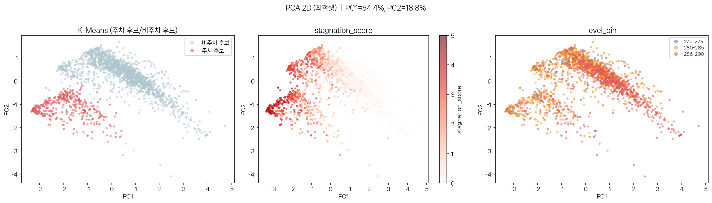
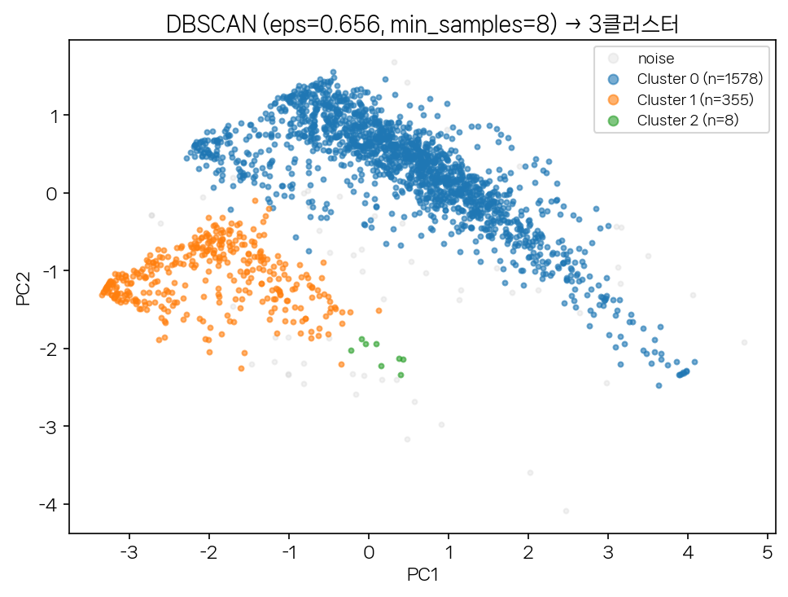
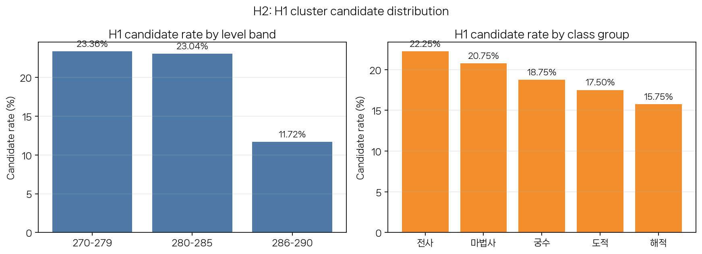
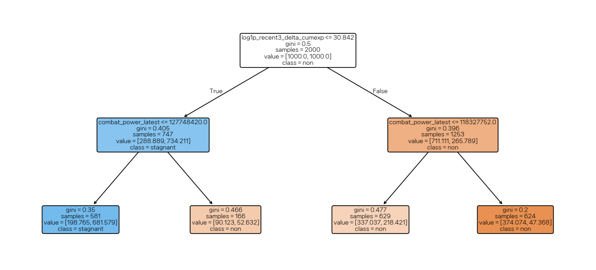
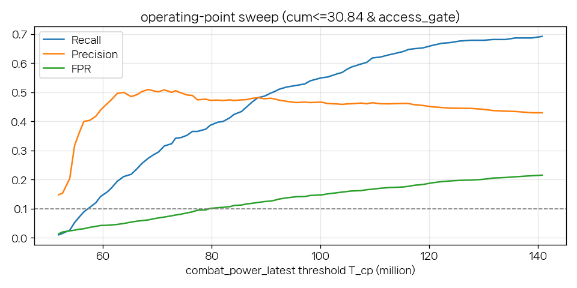
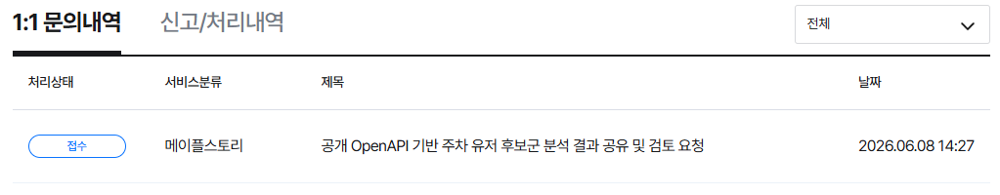

# 메이플스토리 주차 유저 후보군 탐지: 성장 데이터 군집 분석

| | | |
| :---: | ----- | ----- |
| 소프트웨어융합학과 3학년 | 응용데이터분석 텀프로젝트 | 2022105449 김연길 |

> 초록 (Abstract) — MMORPG에는 캐릭터 성장을 의도적으로 동결한 채 보스 주간 재화만 반복 수급하는 주차 유저가 존재한다. 본 연구는 Nexon OpenAPI로 직접 관측 가능한 성장·접속 신호만으로 메이플스토리 주차 후보군을 식별하는 것을 목적으로 한다. 공개 API에는 보스 수행·메소 생산·거래 기록이 없으므로, 전투력·HEXA·유니온·어센틱 심볼 4개 성장 시스템의 최근 6개월 변화량을 재투자 부진의 proxy로 설계했다. 레벨 270~290 본캐 2,000명(5계열×400, 전투력 5,000만 이상, 12개월 중 ≥10개월 접속 통제)을 수집하고 K-Means(k=4)로 전투력이 오히려 감소하고 4개 시스템 성장이 모두 최저인 주차 후보군 380명(19.0%)을 식별했다. 이 군집은 DBSCAN 밀도 군집(355명)과 강하게 정합해 구조 안정성이 확인됐다. 후보 비율은 레벨 구간에 따라 유의하게 불균일했으나(280–285 집중, p=4.27e-9) 직업 계열에서는 무유의해 가설2는 부분 지지됐다. 가설1이 쓰지 않은 관측 피처만으로 RandomForest가 후보군을 ROC-AUC 0.850으로 근사했고, 단순 규칙이 허용 거짓양성률(FPR 0.068≤0.10) 내에서 후보 라벨을 재현해 가설3도 제한적으로 지지됐다. 본 연구의 의의는 내부 로그 없이 공개 데이터만으로 운영 검토 가능한 주차 후보군을 정의·검증·설명하는 재현 가능한 파이프라인을 제시한 데 있다.

---

## 1. 서론

메이플스토리를 비롯한 장기 서비스 MMORPG는 모든 유저에게 성장의 비약·경험치 쿠폰 등 이벤트 재화를 정기 지급한다. 그래서 접속만 꾸준히 해도 누구나 어느 정도 성장하며, 성장이 완전히 멈춘 유저는 사실상 없다. 그럼에도 고레벨 구간에는 레벨과 스펙을 의도적으로 특정 지점에 묶어둔 채 보스 주간 보상만 반복 수급하고 그 재화를 자기 성장에 재투자하지 않는 유저층이 관찰된다. 일부는 이 재화를 비공식 암거래로 현금화하는데, 이는 넥슨 운영정책상 금지된 행위다. 본 연구는 이들을 주차 유저로 규정한다.

주차는 게임사가 인지하는 운영 현안이다. 메이플스토리 디렉터는 라이브 방송에서, 성장을 일정 지점에 고정한 채 재화를 생산해 시장에 일방향 공급하는 주차 유저의 메소 생산량만 줄이려 했으나 그들만 타겟팅하기는 현재 어렵다고 언급했다[1]. 이들이 반복 생산하는 게임 화폐 메소는 공급 규모 탓에 인플레이션을 일으켜 경제 밸런스를 교란한다. 문제는 외관상 일반 유저와 행동이 비슷해 규칙 기반 선별이 어렵다는 점이다. 본 연구는 이 타겟팅 난점을, 공개 데이터로 관측 가능한 성장·접속 신호에서 후보군을 식별하는 문제로 옮긴다. 핵심 질문은 "내부 로그 없이 공개 OpenAPI 신호만으로 주차 의심 후보군을 통계적으로 식별·검증할 수 있는가"다.

이에 주차를 "절대적으로 멈춘 유저"가 아니라 "모집단 성장률 분포에서 상대 하위이면서 여전히 활발히 접속하는 유저"로 조작적 정의하고, 보스 재화 벌이는 직접 관측 불가하므로 레벨·접속·저재투자의 조합으로 추론하며 결과는 확정이 아닌 후보 라벨로 한정한다. 기존 MMORPG 이상행동 연구는 봇·골드파밍처럼 명시적 악성 행동을 내부 로그·제재 라벨로 탐지하나[2][3][4], 본 연구는 대상이 정상 유저일 수 있는 active 주차 후보이고 데이터가 공개 API로 제한되며 ground truth 라벨이 없다는 점에서 차별되고(상세는 2장), 기존 메이플 조회 서비스[5][6]도 개별 캐릭터의 현재 스펙 제공에 그쳐 다수 캐릭터의 장기 정체·저재투자를 코호트로 분석하지 않는다.

이상의 배경에서 본 연구는 세 가설을 검증한다.

- 가설1: 최근 6개월간 주요 성장 지표가 낮은 활성 캐릭터들은 일반 성장 캐릭터와 뚜렷이 구분되는 하나의 군집, 곧 주차 후보군으로 묶일 것이다.
- 가설2: 주차 후보군의 비율은 캐릭터의 레벨 구간과 직업 계열에 따라 유의미하게 다를 것이다.
- 가설3: 주차 후보군은 군집화에 쓰지 않은 다른 관측값만으로도 설명 가능한 단순한 규칙으로 예측할 수 있을 것이다.

이를 검증하고자 레벨 270~290 본캐 2,000명(5계열 균등)의 12개월 월별 스냅샷을 수집해 최근 6개월 변화량을 핵심 피처로 산출했다. 가설1은 K-Means 비지도 군집화로 후보군을 도출하고 DBSCAN으로 보조 검증하며, 가설2는 카이제곱 독립성 검정으로 후보 비율의 속성별 불균일성을, 가설3은 가설1이 쓰지 않은 관측 피처로 RandomForest와 얕은 결정트리 규칙을 학습해 후보군을 설명 가능하게 근사한다. 그 결과 19.0%의 후보군을 안정적으로 식별하고 레벨 구간의 분포 편향과 단순 규칙 근사 가능성을 확인했다.

---

## 2. 관련 연구

게임 행동 텔레메트리 군집화 연구는 라벨 없는 플레이 데이터를 비지도로 묶고 단일 성능지표가 아니라 해석 가능한 행동 프로필로 평가한다. Drachen 등[2]은 World of Warcraft 약 7만 명을 여러 군집화 기법으로 비교해 군집을 행동 프로필로 해석했다. 본 연구 가설1도 라벨 없는 성장 데이터에서 군집을 만들어 silhouette이 아닌 성장 프로필로 해석하므로 같은 철학을 공유한다. 다만 본 연구는 내부 텔레메트리 기반 일반 세분화가 아니라 공개 API만으로 "최근 6개월 성장 정체·재투자 부진" 단일 문제로 좁힌다.

봇·골드파밍 탐지 연구는 재화 생산·현금화·반복 행동을 핵심 신호로 본다. Chung 등[3]은 플레이 스타일별 로컬 봇 탐지로 저해상도 데이터에서도 도메인 피처 설계가 가능함을 보였고(본 연구의 월 1회 스냅샷 4개 시스템 delta 설계 근거), Keegan 등[4]은 골드파머 탐지에서 재화 생산·현금화가 이상행동의 배경임을(메이플 주차의 경제 동기와 연결), Kang 등[7]은 멀티모달 결합이 단일 지표보다 우수함을(4개 시스템 delta 결합 근거), Kim 등[8]과 Son·Kim[9]은 라벨 없는 데이터를 비지도(DBSCAN)로 묶어 설명 가능한 운영 검토를 구성함을 보였다(본 연구의 K-Means→DBSCAN 보조검증·가설3 규칙과 같은 방향, 단 본 연구는 빠른 자동 레벨업이 아닌 그 반대인 성장 정체를 다룬다).

기존 연구·서비스 대비 본 연구의 차별점은 [표 1]과 같다.

[표 1] 기존 연구·서비스 대비 차별점

| 구분 | 기존 연구·서비스 | 본 연구 |
|---|---|---|
| 대상 문제 | 봇·골드파밍·자동 레벨업 등 명시적 악성[2][3][4][8] | 고접속·고레벨 active 주차 후보 |
| 데이터 | 내부 서버 로그·좌표·거래·제재 라벨 | 공개 Nexon OpenAPI 스냅샷[5] |
| 라벨 철학 | 정상/봇 분류 성능 목표 | ground truth 부재 전제, 후보 라벨 |
| 피처 | 단일 행동·레벨업 속도 위주 | 4개 성장 시스템의 6개월 delta 결합 |
| 산출물 | 개인 단위 탐지·조회[5][6] | 표본 단위 후보 라벨 + 분포 검정 + 규칙 |

본 연구의 기여는 공개 API라는 제한된 조건에서 운영 검토 가능한 후보군을 체계적으로 정의하고 분포와 규칙으로 설명한 데 있으며, "주차 유저를 확정했다"는 주장과는 선을 긋는다.

---

## 3. 본론

### 3.0 데이터 설명 및 수집 방법

Nexon 메이플스토리 OpenAPI[5]를 사용한다(초당 500회·일 2,000만 회 한도 → 수집 시 초당 400회로 제한, 데이터 가용 기간 최근 2년). 본캐 표본은 `collect_main_characters.py`로 `ranking/overall`(레벨 내림차순)에서 직업명별 이진 탐색으로 레벨 270~290 구간을 확정해 5개 직업 계열(전사·마법사·궁수·도적·해적)×400명=2,000명을 균등 수집한다. 각 후보는 `character/basic` 생성일(12개월 윈도우를 관측할 수 없는 신규 캐릭터 배제, 컷오프 2025-06-30)과 `user/union-raider`(max 유니온 배치 블록 레벨 ≤ 캐릭터 레벨)로 본캐만 채택한다. 레벨을 270~290으로 한정한 이유는 두 가지다. 의미 있는 주간 보스를 클리어해 보상을 수급하려면 적어도 이 구간에 도달해야 하므로 주차 동기의 하한이 270 부근이고, 290 초과 구간은 핵심 피처 스케일이 크게 달라져 동일 분포에서 함께 군집화하기 어렵기 때문이다. 같은 맥락에서 마지막 수집월 최대 전투력 5,000만 이상만 포함해 보스 재화 수급이 가능한 active/capable 표본으로 한정하고, 메소 거래가 불가능한 리부트 월드는 제외한다(`world_type=0`). 수집 기준일과 시드는 고정해 재현성을 보장한다.

월별 피처는 `collect_features.py`로 12개월(2025-06~2026-05) 월별 `character/basic`·`stat`(7일치 중 최대 전투력)·`union`·`symbol-equipment`·`hexamatrix`를 조회해 월평균 변화량과 최근 3·6개월 기울기를 산출한다. 접속은 통제변인으로 둔다. `access_flag`(최근 7일 접속)를 집계해 12개월 중 ≥10개월 접속한 캐릭터만 표본에 포함시켜 전원이 `access_active_months ≥ 10`(100%, min 10/max 12)이 되도록 했다. 접속은 군집을 교란하는 축이 아니라 active 표본을 한정하는 통제 조건이므로 클러스터링 피처에서 전면 제외한다. 이는 "휴면이 아니라 활발히 접속하면서 재투자하지 않는다"는 주차의 조작적 정의를 표본 설계 단계에서 강제하기 위함이다.

### 3.1 가설1: 주차 후보군의 식별

주차는 "현재 진행 중인 행동"이므로 분석 윈도우를 최근 6개월(2025-12~2026-05) delta로 좁히고, 4개 성장 시스템의 미재투자를 다면 포착하는 다음 4개 피처를 채택한다([표 2]).

[표 2] 가설1 채택 피처 (4-시스템 다축, 6개월 윈도우)

| Alias | 변환·정의 | 성장 시스템 |
|---|---|---|
| `cp_slog` | 전투력 월 Δ를 winsor(p01–p99) 후 `sign(x)·log1p(\|x\|)` | 전투력 |
| `hexa_avg` | `avg_monthly_delta_hexa`를 clip≥0 + 상단 p99 | HEXA 코어 |
| `union_log` | `log1p(clip≥0 Δ유니온레벨)` | 유니온 |
| `auth_log` | `log1p(clip≥0 Δ어센틱심볼)` | 어센틱 심볼 |

전투력 Δ는 소수 극단값이 한쪽 꼬리를 길게 늘이는 heavy-tail이며 6개월 기준 19.4%가 음수(전투력 감소=강한 주차 신호)다. raw 값은 이 극단값이 K-Means 거리 계산을 지배해 다수의 미세한 정체·하락 차이를 묻으므로, 부호를 보존하며 분포를 압축하는 signed-log 변환이 핵심이다. 4개 피처는 다중공선성을 통과한다(VIF 최대 1.59). 표준화 후 K-Means를 적용하며, k는 inertia 꺾임(elbow)이 뚜렷한 k=4를 운영점으로 채택한다. silhouette은 k=6에서 최대(0.384)이나 값 자체가 낮고, 여러 시스템의 재투자 부진을 폭넓게 묶는 후보군 정의에도 k=4(silhouette 0.357)가 더 잘 맞는다.

[표 3] K-Means 군집별 프로필 (상단 4행은 표준화 직전 변환값 평균, 하단 2행은 실측값)

| 항목 | 0 (n=882) | 1 후보 (n=380) | 2 (n=551) | 3 (n=187) |
|---|---:|---:|---:|---:|
| `cp_slog` (전투력 Δ) | +15.05 | −14.54 | +15.45 | +14.15 |
| `hexa_avg` | 2.09 | 1.33 | 6.10 | 1.33 |
| `union_log` | 3.60 | 2.24 | 3.88 | 0.75 |
| `auth_log` | 0.43 | 0.22 | 1.14 | 0.25 |
| 평균 전투력 (실측) | 121.1M | 88.0M | 161.8M | 116.1M |
| 전투력 Δ(6개월) 중앙값 | +3.94M | −2.47M | +8.47M | +2.15M |

군집화 결과 4개 군집(0: 882명, 1: 380명, 2: 551명, 3: 187명)이 형성되고 cluster 1이 주차 후보군(전체 19.0%)으로 식별된다. 후보군은 전투력이 유일하게 감소(signed-log −14.54, 중앙 Δcp −2.47M)하고 HEXA·유니온·어센틱 성장도 모두 최저다. 평균 전투력은 88.0M으로 4군집 중 가장 낮아 최고 군집의 약 54%에 그친다. 즉 "이미 낮은 파워에서 더 정체·하락"하는 패턴이다. 접속은 전 군집이 거의 만점으로 동일해, 후보군은 휴면 집단이 아니라 활발히 접속하면서도 재투자하지 않는 군집으로 드러난다. [그림 1]의 PCA 투영에서도 후보군(붉은색)이 비후보 군집과 공간적으로 분리된다.

[그림 1] PCA 2D 투영(PC1 54.4%·PC2 18.8%). 좌: 주차 후보(붉은색)와 비후보 분리, 우: 레벨 구간.

silhouette 0.36은 낮다. 그러나 표본이 전원 이벤트 baseline 위에서 점진 둔화되는 연속 스펙트럼이라 경계가 흐릿한 것이 정상이고, 가설1 목적도 확정 분류가 아닌 후보 라벨 생성이므로 주 평가지표를 silhouette이 아니라 후보군 프로필과 DBSCAN 정합으로 둔다. 동일 피처 공간에 DBSCAN(min_samples=8, k-거리 그래프의 knee로 eps=0.656 자동 결정)을 적용하면 3개 군집(노이즈 2.9%)이 형성되는데, K-Means 후보 380명 중 355명이 DBSCAN의 한 밀집 군집에 그대로 묶인다([그림 2]). 두 알고리즘 결과가 맞아떨어지므로 후보군 구조는 한 알고리즘에만 의존하지 않으며, 이로써 가설1은 지지된다고 보아도 무리가 없다.

[그림 2] 동일 4개 피처 공간에서의 DBSCAN 보조 검증. K-Means 주차 후보 380명 중 355명이 DBSCAN의 동일 밀집 군집에 포함되어 후보군 구조가 k 설정에만 의존하지 않음을 확인했다.

---

### 3.2 가설2: 주차 후보군 비율의 속성별 분포

가설1 후보 라벨(`is_stagnant_cluster`, 380명)이 캐릭터 사전 속성에 고르게 분포하는지 검정한다. 후보 여부와 속성(레벨 구간 270–279·280–285·286–290, 직업 5계열)이 모두 범주형이므로 카이제곱 독립성 검정이 적합하다. 각 교차표는 유의수준 0.05로 검정한다. 대표본(2,000명)은 미미한 차이도 유의하게 나오기 쉽고 p-value는 어느 칸이 쏠림을 만드는지 알려주지 않으므로, 효과크기 Cramer's V(연관 강도, 0.1 안팎이면 약함)와 표준화 잔차(|값|>2면 그 칸이 쏠림·희박을 주도)를 함께 보고, 추가로 주변합 고정 Monte Carlo(10만 회)로 근사 타당성을, Holm 보정으로 다중검정 거짓양성을 통제한다.

검정 결과([표 4]) 레벨 구간은 강하게 유의했고(χ²=38.54, df=2, p=4.27e-9, Holm 후 8.54e-9, Monte Carlo p≈1e-5, 최소 기대빈도 20.3으로 근사 조건 충족), 효과크기 V=0.139로 매우 강하지는 않으나 명확한 신호다. 반면 직업 계열은 무유의했다(χ²=6.89, df=4, p=0.142, V=0.059).

[표 4] 속성별 카이제곱 독립성 검정 요약 (후보 380명 / 표본 2,000명)

| 속성 | χ²(df) | p | Holm 보정 p | Cramer's V | 판정 |
|---|---:|---:|---:|---:|---|
| 레벨 구간 | 38.54 (2) | 4.27e-9 | 8.54e-9 | 0.139 | 유의 |
| 직업 계열 | 6.89 (4) | 0.142 | 0.142 | 0.059 | 무유의 |

[그림 3] 가설1 후보 비율. 좌: 레벨 구간(280–285·270–279 높고 286–290 급감), 우: 직업 계열(전사 22.3%~해적 15.8%, 유의차 없음).

레벨 구간별 분포를 보면(후보 기대치 = 각 구간 표본 × 19.0%), 280–285는 기대(223명)보다 48명 많은 271명이 후보로 묶이고(비율 23.04%, 잔차 +3.18, OR 1.96), 286–290은 기대(136명)보다 52명 적은 84명에 그친다(비율 11.72%, 잔차 −4.47, OR 0.44). 270–279는 후보 비율(23.36%)이 가장 높지만 n=107 소표본이라 단독 유의성은 없다(잔차 +1.04). 결국 레벨 구간 유의성은 대표본 280–285의 양의 잔차와 286–290의 음의 잔차가 함께 만든 것이다. 280–285 집중은 도메인적으로 자연스럽다. 추가 레벨업 효율이 급락하는 엔드게임 초입이라 "성장을 멈추고 보스 재화만 수급"하기 합리적인 정거장이기 때문이며, 반대로 286–290은 여전히 스펙을 올리는 active 집단이라 후보가 희박하다.

직업 무유의가 레벨 불균형에 가려진 착시일 가능성을 배제하려 레벨을 통제해 각 구간 안에서 직업 계열×후보를 따로 검정했고, 세 구간 모두 무유의했다(특히 최대 표본 280–285도 p=0.225, V=0.069). 직업 무유의는 레벨 통제 후에도 유지되므로 이는 레벨 불균형이 만든 착시가 아니라 직업 계열이 후보 비율과 실제로 무관하다는 근거다. 결국 가설2는 레벨 구간에서는 지지됐지만 직업 계열에서는 그렇지 않아 부분 지지에 그친다. 단 검정 대상이 실제 ground truth가 아닌 가설1 후보 라벨이므로 일반화는 라벨 타당성을 전제하며, 레벨 표본 불균형(107/1,176/717) 탓에 저레벨(270–279) 해석은 보수적으로 둔다.

---

### 3.3 가설3: 주차 후보군의 설명 가능한 단순 규칙 근사

가설3은 가설1 후보군을 다른 관측값으로 재설명한다. 가설1 군집화에 쓰지 않은 피처만으로 후보 라벨(380명)을 얼마나 재현하고 그 재현을 사람이 읽는 단순 규칙으로 압축할 수 있는지 검증한다. 가설1 후보 라벨을 target으로 하는 지도학습 분류로 바꾸되, 가설1이 사용한 4개 변화량 축(전투력·HEXA·유니온·어센틱의 6개월 delta)은 입력에서 전면 배제한다. 입력은 가설1과 정보적으로 겹치지 않는 13개 후보 피처다. 첫째는 변화량이 아닌 특정 시점의 절대 수준값인 상태 피처(레벨·전투력·유니온 레벨·어센틱 점수·HEXA 합·누적경험치 로그·캐릭터 연령)이고, 둘째는 가설1이 쓰지 않은 누적경험치 증분(log1p의 12개월·최근 3·6개월)이다. 여기에 상대 중요도 확인용 접속 계열 3개를 더한다. 각 피처와 가설1 4개 축의 |corr|>0.85면 누수로 제거하지만, 실제 제거는 0건이고 최대 상관도 0.535(`hexa_level_sum`↔HEXA delta 축)에 그쳤다. 상태값과 누적경험치 증분이 가설1 군집 경계를 베껴오지 않은 독립 관측 피처라는 뜻이다.

모델은 해석 가능성을 위해 RandomForest 단독(`class_weight=balanced`, `n_estimators=400`, 나머지 scikit-learn 기본값)으로 학습한다. 성능은 층화 5-fold out-of-fold로 평가하고, permutation importance로 핵심 변수를 추린 뒤 얕은(depth-2) 결정트리로 규칙을 뽑아 접속 게이트와 결합한다. 5-fold OOF ROC-AUC는 0.8495(PR-AUC 0.5365로 기저율 0.190의 약 2.8배)로, 가설1 핵심축 없이 상태값·누적경험치 증분만으로 후보군을 상당 부분 근사한다(핵심축을 의도적으로 뺐으므로 완전 복제가 아닌 근사). permutation importance 상위는 최근 3개월 누적경험치 증분(낮을수록 정체, 0.108), 전투력 절대값(0.102), 최근 6개월 누적경험치 증분(0.098) 순이고, 접속 계열은 0에 가까워(`access_active_months` 0.0018) ≥10 접속 통제가 접속의 변별력을 제거했음이 정량 확인된다. 접속은 분류 피처가 아니라 게이트로만 타당하다는 설계 전제가 여기서 검증된다.

상위 2개 변수로 depth-2 결정트리를 학습하면 단 두 번의 분기로 후보군이 갈린다([그림 4]). 1차 분기는 최근 3개월 누적경험치 증분(`log1p ≤ 30.84`), 그 아래에서 전투력으로 다시 나뉜다. 누적경험치가 낮고(성장 동결) 전투력이 낮은(저스펙) 잎이 정체로 분류되어 주차의 조작적 정의(성장 동결+저재투자)와 직접 대응한다.

[그림 4] 가설3 depth-2 결정트리. 1차 분기=최근 3개월 누적경험치 증분, 2차 분기=전투력. 성장 동결·저스펙 잎이 정체로 분류되어 주차의 조작적 정의와 직접 대응한다.

트리가 그대로 내놓는 전투력 임계(127.7M)는 581명을 정체로 잡아 과다 검출(FPR 0.199)이므로, 전투력 임계 `T_cp`를 sweep해 목표 FPR≤0.10을 만족하는 70M을 채택한다(70M에서 FPR 0.068·Precision 0.500, 80M부터 0.10 초과; [그림 5]).

[그림 5] 전투력 임계 `T_cp` sweep. 70M은 FPR 0.068로 목표선 0.10 이내를 만족하면서 precision 0.500을 유지하는 보수 운영점이다.

[표 5] 최종 운영 규칙 성능 (vs 가설1 후보 380명, in-sample)

| 규칙 | 양성수 | Precision | Recall | FPR |
|---|---:|---:|---:|---:|
| loose 트리(대조) | 581 | 0.446 | 0.682 | 0.199 |
| 최종 규칙 (운영점) | 220 | 0.500 | 0.289 | 0.068 |

채택 규칙은 `recent3 누적EXP(log1p) ≤ 30.84 AND 전투력 ≤ 70,000,000 AND 접속 ≥ 2`다([표 5]). 운영점은 loose 대비 FPR을 0.199→0.068(약 2.9배↓)로 낮추고 precision을 높인다. 접속 게이트는 ≥10 통제 표본이라 전원 통과(in-sample no-op)하나 공식 운영 시 휴면 유저를 제외하는 명시 요건으로 유지한다. 최강 비-가설1 판별자가 "최근 누적경험치 증분(성장 동결)"과 "낮은 전투력 절대값(저스펙)"이라는 점은 주차의 조작적 정의와 직접 정합한다. 가설3은 제한적으로 지지된다. 단순 규칙이 허용 FPR(in-sample 0.068≤0.10) 내에서 가설1 후보를 설명 가능하게 재현했고, ROC-AUC 0.850 역시 이 결론을 뒷받침한다. 다만 (i) sweep·규칙 평가는 held-out 분할이 없는 in-sample 적합도라 "실제 주차 탐지력"이 아니라 "가설1 후보 라벨 근사도"이고, (ii) 가설1 라벨 자체가 proxy이며, (iii) 보수 운영점이라 recall(0.289)이 낮다(T_cp 80~100M 완화 시 recall 0.39~0.55, FPR 0.10~0.15).

---

## 4. 결론

본 연구는 공개 Nexon OpenAPI만으로 메이플스토리 주차 후보군을 탐색하는 재현 가능한 파이프라인을 제시했다. 레벨 270~290 본캐 2,000명(≥10/12 접속 통제)의 최근 6개월 성장 delta를 4개 시스템으로 설계해 K-Means(k=4)로 전투력이 오히려 감소하고 4개 시스템 성장이 모두 최저인 후보군 380명(19.0%)을 식별했다(가설1 지지, DBSCAN 밀도 군집 355명과 강하게 정합해 구조 안정성 확보). 후보 비율은 레벨 구간에 유의하게 불균일했으나(280–285 집중) 직업 계열엔 무유의해, 주차를 좌우하는 것은 직업이 아닌 성장 단계였다(가설2 부분 지지). 가설1이 쓰지 않은 관측 피처만으로 RandomForest가 후보군을 ROC-AUC 0.850으로 근사하고 단순 규칙이 허용 FPR 내에서 후보 라벨을 재현했다(가설3 제한적 지지).

이 결과에서 끌어낼 인사이트가 있다. 우선 주차 후보는 휴면 유저가 아니라 거의 매월 접속하면서도 전투력이 오히려 감소·정체하는 상대 하위 군집이므로, 접속은 탐지 피처가 아니라 표본을 active로 한정하는 통제 조건으로 다뤄야 한다. 또 주차는 특정 직업 현상이 아니라 추가 성장 효율이 급락하는 280–285 엔드게임 정거장에 집중된 현상이었다. 마지막으로, 내부 로그 없이도 전투력 절대값과 최근 누적경험치 증분이라는 공개 관측치만으로 후보군을 설명 가능한 단순 규칙으로 근사할 수 있다.

나아가 본 연구는 결과를 운영 주체에게 전달했다. 위 인사이트와 핵심 수치를 메이플스토리 고객센터에 건의로 제출했다([그림 6]). 내부 로그를 보유한 운영팀이라면 본 연구의 공개 API proxy를 실제 보스 재화·메소 거래 로그와 결합해 후보군 타당성을 검증할 수 있고, 본 연구의 단순 규칙은 디렉터가 밝힌 "주차 유저만 선별·타겟팅하기 어렵다"는 난점의 데이터 기반 1차 필터로 쓰이되, 정상 유저가 섞일 수 있으므로 자동 제재가 아닌 운영 검토 단계로만 활용해야 한다. 한계도 분명하다. 공개 API엔 보스·메소·거래 기록이 없어 후보 라벨을 직접 검증할 수 없고, 결론은 270~290 active/capable 본캐 표본 안에서만 일반화된다. 가설3 규칙 평가도 in-sample 근사도여서 실제 탐지력 검증은 외부 데이터를 활용한 후속 과제로 남는다.

[그림 6] 메이플스토리 고객센터 건의사항 접수 내역.

---

## 5. 참고 문헌

[1] 메이플스토리 (공식 YouTube 채널), "Maple Now 랜선투어 | 김창섭 디렉터," 라이브 아카이브, 2026-03-14, https://www.youtube.com/live/lRThIrUwv08?t=8798 (해당 발언 2:26:38~, accessed 2026-06).

[2] A. Drachen, C. Thurau, R. Sifa, and C. Bauckhage, "A Comparison of Methods for Player Clustering via Behavioral Telemetry," Proc. Foundations of Digital Games (FDG), arXiv:1407.3950, 2013/2014.

[3] Y. Chung, C. Park, N. Kim, et al., "A Behavior Analysis-Based Game Bot Detection Approach Considering Various Play Styles," ETRI Journal, 35(6), pp. 1058–1067, arXiv:1509.02458, 2013/2015.

[4] B. Keegan, M. A. Ahmad, D. Williams, J. Srivastava, and N. Contractor, "Mining for Gold Farmers: Automatic Detection of Deviant Players in MMOGs," University of Minnesota Technical Report, hdl:11299/215803, 2009.

[5] Nexon, "메이플스토리 OpenAPI 문서," Nexon Open API, https://openapi.nexon.com/game/maplestory/ (accessed 2026-06).

[6] Maple.GG, 캐릭터·랭킹 조회 서비스, https://maple.gg/ (accessed 2026-06).

[7] A. R. Kang, J. Woo, J. Park, and H. K. Kim, "Multimodal Game Bot Detection using User Behavioral Characteristics," SpringerPlus, 5(523), arXiv:1606.01426, 2016.

[8] S. Kim et al., "A Framework for Mining Collectively-Behaving Bots in MMORPGs," Proc. ICPR, arXiv:2501.10461, 2024/2025.

[9] J. Son and H. K. Kim, "Human-AI Collaborative Bot Detection in MMORPGs," arXiv:2508.20578, 2025.
