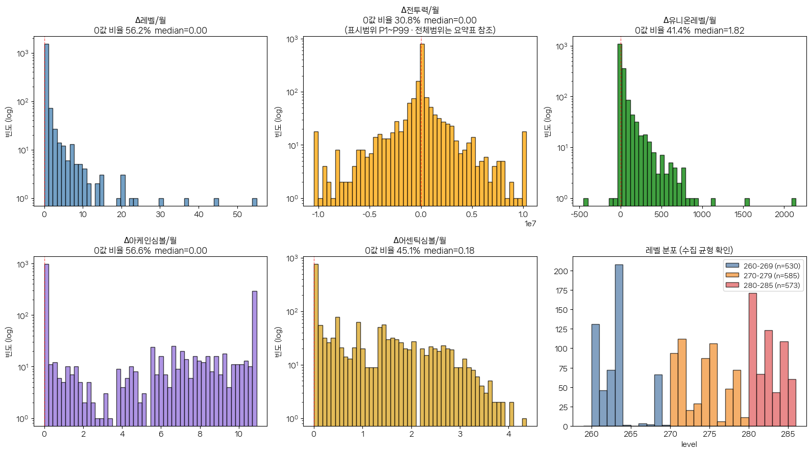
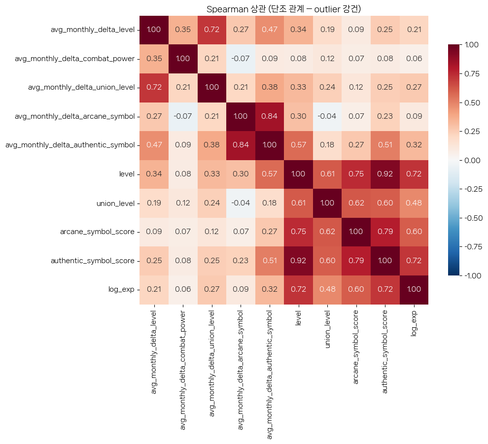
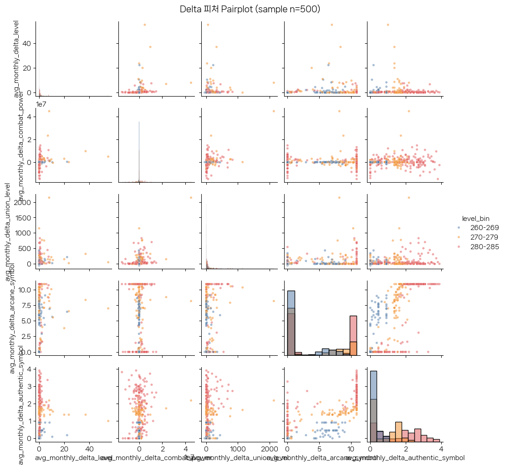
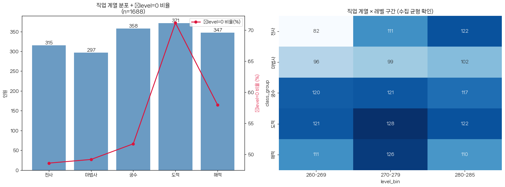
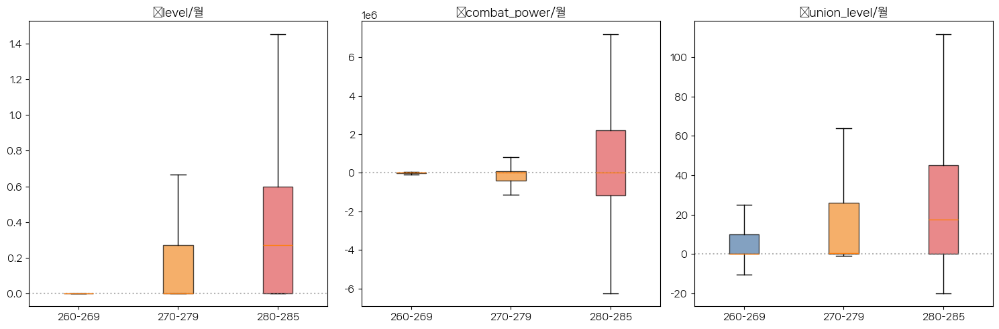
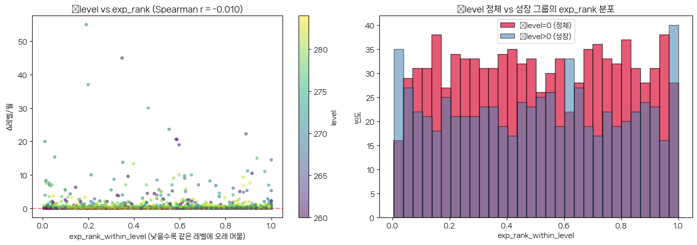
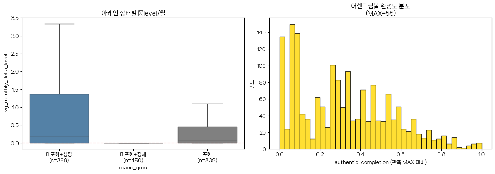
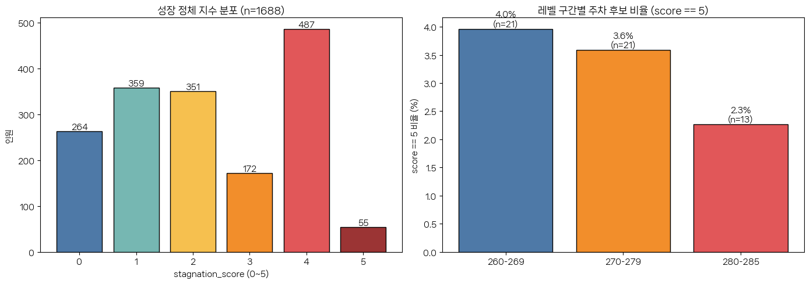

# 메이플스토리 주차 유저 클러스터링 — EDA (v2)

> **입력**: `../data/features_monthly.csv` (12개월 스냅샷 기반, 2,000명) + `../data/main_characters.csv` (class_group)
>
> **목적 1**: H1/H2/H3 가설 검증에 필요한 데이터 가공·전처리 결정 확정
> **목적 2**: 가설 외 추가 인사이트 (정체지수, 경험치, 심볼 포화도) 발굴
>
> **흐름**: Sec0 환경 → Sec1 품질 → Sec2 단변량 → Sec3 이변량 → Sec4 직업계열 → Sec5 레벨구간+H2 사전 → Sec6 경험치 → Sec7 심볼 → Sec8 정체지수 → Sec9 가설 검증 가능성 → Sec10 최종 전처리·피처셋


## Sec 0. 환경 설정 및 데이터 로드


```python
%matplotlib inline
import pandas as pd
import numpy as np
import matplotlib.pyplot as plt
import seaborn as sns
from scipy.stats import chi2_contingency, spearmanr
from scipy.stats.mstats import winsorize
from pathlib import Path
import warnings
warnings.filterwarnings('ignore')

# 한글 폰트
import matplotlib.font_manager as fm
font_path = Path('../assets/NanumSquareNeo-bRg.ttf')
if font_path.exists():
    fe = fm.FontEntry(fname=str(font_path), name='NanumSquareNeo')
    fm.fontManager.ttflist.insert(0, fe)
    plt.rcParams['font.family'] = fe.name
else:
    import platform
    plt.rcParams['font.family'] = {'Windows': 'Malgun Gothic', 'Darwin': 'AppleGothic'}.get(platform.system(), 'DejaVu Sans')
plt.rcParams['axes.unicode_minus'] = False
plt.rcParams['figure.dpi'] = 100

np.random.seed(42)

# ── 분석 상수 ───────────────────────────────────────────────────────────────
ARCANE_MAX = 120
DELTA_COLS = [
    'avg_monthly_delta_level',
    'avg_monthly_delta_combat_power',
    'avg_monthly_delta_union_level',
    'avg_monthly_delta_arcane_symbol',
    'avg_monthly_delta_authentic_symbol',
]
LEVEL_BIN_ORDER = ['260-269', '270-279', '280-285']
BIN_PALETTE = {'260-269': '#4e79a7', '270-279': '#f28e2b', '280-285': '#e15759'}
GROUP_ORDER = ['전사', '마법사', '궁수', '도적', '해적']  # 수집 단계에서 5계열 층화 완료 (기타/결측 없음 — Sec 1 확인)
print('imports OK')
```

    imports OK
    


```python
# 데이터 로드 + class_group 병합
df_raw = pd.read_csv('../data/features_monthly.csv', encoding='utf-8-sig')
mc = pd.read_csv('../data/main_characters.csv', encoding='utf-8-sig', usecols=['ocid', 'class_group'])
df = df_raw.merge(mc, on='ocid', how='left')

# 레벨 구간 (수집 시 사용한 동일 경계: 260-269 / 270-279 / 280-285)
df['level_bin'] = pd.cut(df['level'], bins=[259, 269, 279, 285], labels=LEVEL_BIN_ORDER)

print(f'features_monthly: {df_raw.shape}, merged: {df.shape}')
print(f'class_group 결측: {df["class_group"].isna().sum()}행 (병합 실패)')
print(f'수집 윈도우: {df["first_valid_month"].iloc[0]} ~ {df["last_valid_month"].iloc[0]} (num_valid_months 항상 {df["num_valid_months"].iloc[0]})')

df.describe(include=[np.number]).T.round(2)
```

    features_monthly: (2000, 18), merged: (2000, 20)
    class_group 결측: 0행 (병합 실패)
    수집 윈도우: 2025-06 ~ 2026-05 (num_valid_months 항상 12)
    


<div>
<style scoped>
    .dataframe tbody tr th:only-of-type {
        vertical-align: middle;
    }

    .dataframe tbody tr th {
        vertical-align: top;
    }

    .dataframe thead th {
        text-align: right;
    }
</style>
<table border="1" class="dataframe">
  <thead>
    <tr style="text-align: right;">
      <th></th>
      <th>count</th>
      <th>mean</th>
      <th>std</th>
      <th>min</th>
      <th>25%</th>
      <th>50%</th>
      <th>75%</th>
      <th>max</th>
    </tr>
  </thead>
  <tbody>
    <tr>
      <th>level</th>
      <td>1921.0</td>
      <td>2.729100e+02</td>
      <td>8.750000e+00</td>
      <td>200.00</td>
      <td>2.630000e+02</td>
      <td>2.740000e+02</td>
      <td>2.800000e+02</td>
      <td>2.850000e+02</td>
    </tr>
    <tr>
      <th>union_level</th>
      <td>1823.0</td>
      <td>6.252130e+03</td>
      <td>2.958840e+03</td>
      <td>221.00</td>
      <td>3.627000e+03</td>
      <td>7.435000e+03</td>
      <td>8.806000e+03</td>
      <td>1.036600e+04</td>
    </tr>
    <tr>
      <th>arcane_symbol_score</th>
      <td>2000.0</td>
      <td>9.621000e+01</td>
      <td>3.165000e+01</td>
      <td>0.00</td>
      <td>8.000000e+01</td>
      <td>1.120000e+02</td>
      <td>1.200000e+02</td>
      <td>1.200000e+02</td>
    </tr>
    <tr>
      <th>authentic_symbol_score</th>
      <td>2000.0</td>
      <td>1.679000e+01</td>
      <td>1.276000e+01</td>
      <td>0.00</td>
      <td>5.000000e+00</td>
      <td>1.600000e+01</td>
      <td>2.600000e+01</td>
      <td>5.500000e+01</td>
    </tr>
    <tr>
      <th>exp</th>
      <td>1921.0</td>
      <td>7.359962e+12</td>
      <td>1.080750e+13</td>
      <td>31269087.00</td>
      <td>8.112855e+11</td>
      <td>1.852144e+12</td>
      <td>7.250986e+12</td>
      <td>4.891313e+13</td>
    </tr>
    <tr>
      <th>log_exp</th>
      <td>1921.0</td>
      <td>2.841000e+01</td>
      <td>1.930000e+00</td>
      <td>17.26</td>
      <td>2.742000e+01</td>
      <td>2.825000e+01</td>
      <td>2.961000e+01</td>
      <td>3.152000e+01</td>
    </tr>
    <tr>
      <th>avg_monthly_delta_level</th>
      <td>1750.0</td>
      <td>7.500000e-01</td>
      <td>3.170000e+00</td>
      <td>0.00</td>
      <td>0.000000e+00</td>
      <td>0.000000e+00</td>
      <td>4.000000e-01</td>
      <td>5.500000e+01</td>
    </tr>
    <tr>
      <th>avg_monthly_delta_combat_power</th>
      <td>1757.0</td>
      <td>-8.136777e+04</td>
      <td>4.218794e+06</td>
      <td>-95529488.33</td>
      <td>-2.957174e+05</td>
      <td>0.000000e+00</td>
      <td>1.662169e+05</td>
      <td>4.490494e+07</td>
    </tr>
    <tr>
      <th>avg_monthly_delta_union_level</th>
      <td>1689.0</td>
      <td>4.437000e+01</td>
      <td>1.259100e+02</td>
      <td>-451.18</td>
      <td>0.000000e+00</td>
      <td>1.820000e+00</td>
      <td>3.060000e+01</td>
      <td>2.142000e+03</td>
    </tr>
    <tr>
      <th>avg_monthly_delta_arcane_symbol</th>
      <td>2000.0</td>
      <td>3.840000e+00</td>
      <td>4.580000e+00</td>
      <td>-10.18</td>
      <td>0.000000e+00</td>
      <td>0.000000e+00</td>
      <td>8.550000e+00</td>
      <td>1.091000e+01</td>
    </tr>
    <tr>
      <th>avg_monthly_delta_authentic_symbol</th>
      <td>2000.0</td>
      <td>8.400000e-01</td>
      <td>1.020000e+00</td>
      <td>-2.82</td>
      <td>0.000000e+00</td>
      <td>3.600000e-01</td>
      <td>1.550000e+00</td>
      <td>4.360000e+00</td>
    </tr>
    <tr>
      <th>num_valid_months</th>
      <td>2000.0</td>
      <td>1.200000e+01</td>
      <td>0.000000e+00</td>
      <td>12.00</td>
      <td>1.200000e+01</td>
      <td>1.200000e+01</td>
      <td>1.200000e+01</td>
      <td>1.200000e+01</td>
    </tr>
  </tbody>
</table>
</div>


## Sec 1. 데이터 품질 진단

전처리 결정에 필요한 결측·이상치 근거를 수집한다.
v2 수집 결과 특이사항을 먼저 카탈로그화한 뒤 분석용 `df_clean` 정의.


```python
# 결측치 현황
null_s = df.isnull().sum()
null_pct = (null_s / len(df) * 100).round(2)
null_tbl = pd.DataFrame({'결측수': null_s, '결측률(%)': null_pct})
null_tbl = null_tbl[null_tbl['결측수'] > 0].sort_values('결측수', ascending=False)
print('[컬럼별 결측]')
print(null_tbl.to_string())
```

    [컬럼별 결측]
                                    결측수  결측률(%)
    avg_monthly_delta_union_level   311   15.55
    avg_monthly_delta_level         250   12.50
    avg_monthly_delta_combat_power  243   12.15
    union_level                     177    8.85
    level_bin                        89    4.45
    log_exp                          79    3.95
    level                            79    3.95
    exp                              79    3.95
    


```python
# 결측 구조 해석 — 필드 단위 결측 + MCAR 검토
print('=== 결측 패턴 ===')

# num_valid_months 는 "character/basic 응답이 온 월 수"일 뿐, 개별 필드 유효성이 아니다.
nvm = sorted(df['num_valid_months'].dropna().unique().tolist())
print(f'num_valid_months 고유값: {nvm}  → 전 행 동일(= basic 응답 횟수). 실제 결측은 필드 단위로 발생.\n')

level_nan = df['level'].isna()
print(f'1. level NaN: {level_nan.sum()}행')
print(f'   → 마지막 유효월 basic 의 character_level 이 null (신규 생성·기록 희소 OCID). 전 수치 컬럼 NaN → 제외 필수.')

dlv_nan = df['avg_monthly_delta_level'].isna()
print(f'2. Δlevel NaN: {dlv_nan.sum()}행 ({dlv_nan.mean()*100:.1f}%)')
print(f'   → level 값이 존재하는 월이 2개 미만 → 변화량 산출 불가. 분석 제외.')

core = DELTA_COLS[:3]   # Δlevel / Δcp / Δunion
core_all_nan = df[core].isnull().all(axis=1)
core_any_nan = df[core].isnull().any(axis=1)
print(f'3. 핵심 3-delta 전부 NaN: {core_all_nan.sum()}행  (level NaN {level_nan.sum()}행은 이 집합의 부분집합)')
print(f'   핵심 3-delta 중 하나라도 NaN: {core_any_nan.sum()}행  → listwise deletion 대상')

union_nan_only = df['union_level'].isna() & df['level'].notna()
print(f'4. union_level(스냅샷) NaN & level 정상: {union_nan_only.sum()}행  → 유니온 미가입 → 0 클램프')

# MCAR 검토: 핵심 delta 결측 행 vs 정상 행의 레벨 분포 비교
#   (level 자체가 NaN 인 행은 .mean() 에서 자동 제외되므로 사실상 'level 정상·delta 결측' 행이 비교 대상)
print(f'\nNaN 행 레벨 평균: {df.loc[core_any_nan, "level"].mean():.1f}  vs  정상 행: {df.loc[~core_any_nan, "level"].mean():.1f}')
print('→ 평균 레벨이 비슷하면 MCAR 가정 합리적 → listwise deletion 무편향.')
```

    === 결측 패턴 ===
    num_valid_months 고유값: [12]  → 전 행 동일(= basic 응답 횟수). 실제 결측은 필드 단위로 발생.
    
    1. level NaN: 79행
       → 마지막 유효월 basic 의 character_level 이 null (신규 생성·기록 희소 OCID). 전 수치 컬럼 NaN → 제외 필수.
    2. Δlevel NaN: 250행 (12.5%)
       → level 값이 존재하는 월이 2개 미만 → 변화량 산출 불가. 분석 제외.
    3. 핵심 3-delta 전부 NaN: 243행  (level NaN 79행은 이 집합의 부분집합)
       핵심 3-delta 중 하나라도 NaN: 311행  → listwise deletion 대상
    4. union_level(스냅샷) NaN & level 정상: 98행  → 유니온 미가입 → 0 클램프
    
    NaN 행 레벨 평균: 272.0  vs  정상 행: 273.0
    → 평균 레벨이 비슷하면 MCAR 가정 합리적 → listwise deletion 무편향.
    


```python
# 특이 케이스 카탈로그
print('=== 특이 케이스 카탈로그 ===')
print(f'1. delta_cp < 0:          {(df["avg_monthly_delta_combat_power"] < 0).sum()}행 ({(df["avg_monthly_delta_combat_power"] < 0).mean()*100:.1f}%)  ← 장비 교체·통계 노이즈')
print(f'2. delta_union < 0:       {(df["avg_monthly_delta_union_level"] < 0).sum()}행                          ← 유니온 재편성')
print(f'3. delta_arcane < 0:      {(df["avg_monthly_delta_arcane_symbol"] < 0).sum()}행                          ← 시스템상 0으로 클램프 권장')
print(f'4. delta_authentic < 0:   {(df["avg_monthly_delta_authentic_symbol"] < 0).sum()}행                          ← 시스템상 0으로 클램프 권장')
print(f'5. level == 285:          {(df["level"] == 285).sum()}행 ({(df["level"] == 285).mean()*100:.1f}%)            ← 만렙(레벨 정체 자연 발생)')
print(f'6. delta_level == 0:      {((df["avg_monthly_delta_level"] == 0) & df["avg_monthly_delta_level"].notna()).sum()}행 ({((df["avg_monthly_delta_level"] == 0) & df["avg_monthly_delta_level"].notna()).mean()*100:.1f}%)')
print(f'7. arcane_score == 120:   {(df["arcane_symbol_score"] == 120).sum()}행 ({(df["arcane_symbol_score"] == 120).mean()*100:.1f}%) ← 포화')
print(f'8. authentic_score MAX:   {df["authentic_symbol_score"].max()} (이론 한계 88)')
```

    === 특이 케이스 카탈로그 ===
    1. delta_cp < 0:          621행 (31.1%)  ← 장비 교체·통계 노이즈
    2. delta_union < 0:       12행                          ← 유니온 재편성
    3. delta_arcane < 0:      2행                          ← 시스템상 0으로 클램프 권장
    4. delta_authentic < 0:   4행                          ← 시스템상 0으로 클램프 권장
    5. level == 285:          80행 (4.0%)            ← 만렙(레벨 정체 자연 발생)
    6. delta_level == 0:      996행 (49.8%)
    7. arcane_score == 120:   906행 (45.3%) ← 포화
    8. authentic_score MAX:   55 (이론 한계 88)
    


```python
# class_group 병합 건전성 점검 — collect_main_characters.py 가 5계열 층화수집 완료
print('=== class_group 분포 ===')
vc = df['class_group'].value_counts(dropna=False)
print(vc.to_string())

n_na  = df['class_group'].isna().sum()
n_etc = (df['class_group'] == '기타').sum()
groups = set(df['class_group'].dropna().unique())

print(f'\n병합 실패(NaN): {n_na}행 | "기타": {n_etc}행')
if n_na == 0 and n_etc == 0 and groups == set(GROUP_ORDER):
    bal = df['class_group'].value_counts().reindex(GROUP_ORDER)
    print(f'→ 5계열 {GROUP_ORDER} 모두 존재, 각 {int(bal.min())}~{int(bal.max())}명.')
    print('  수집 단계 층화가 완료되어 EDA에서 별도 그루핑/"기타" 처리 불필요.')
    print('  H2 직업×클러스터: 5계열 전체 사용 | H3: 직업명은 피처 아님(군집/rule만 평가).')
else:
    print('→ ⚠ 예상과 다른 그룹/결측 발견 — 수집 매핑 점검 필요.')
    if n_etc:
        print(df.loc[df['class_group'] == '기타', 'character_class'].value_counts().head(20).to_string())
```

    === class_group 분포 ===
    class_group
    전사     400
    마법사    400
    궁수     400
    도적     400
    해적     400
    
    병합 실패(NaN): 0행 | "기타": 0행
    → 5계열 ['전사', '마법사', '궁수', '도적', '해적'] 모두 존재, 각 400~400명.
      수집 단계 층화가 완료되어 EDA에서 별도 그루핑/"기타" 처리 불필요.
      H2 직업×클러스터: 5계열 전체 사용 | H3: 직업명은 피처 아님(군집/rule만 평가).
    


```python
# df_clean 정의 — 분석 본판 (Sec 10 df_final 과 동일 모집단)
# 프로젝트 범위(260≤level≤285)로 한정 후 핵심 delta(level/cp/union) NaN 행 listwise 제거
df_clean = df[df['level'].between(260, 285)].dropna(subset=DELTA_COLS[:3]).copy()

# 시스템상 불가능한 음수 → 0 클램프
for c in ['avg_monthly_delta_arcane_symbol', 'avg_monthly_delta_authentic_symbol']:
    n_neg = (df_clean[c] < 0).sum()
    df_clean.loc[df_clean[c] < 0, c] = 0
    print(f'  {c}: {n_neg}행 클램프 → 0')

# union_level(마지막 월 스냅샷) 결측 → 유니온 미가입으로 보아 0
union_nan_n = df_clean['union_level'].isna().sum()
df_clean['union_level'] = df_clean['union_level'].fillna(0)
print(f'  union_level 결측 {union_nan_n}행 → 0으로 채움 (유니온 미가입)')

print(f'\ndf_clean: {df_clean.shape} (원본 {len(df)}행 중 {len(df) - len(df_clean)}행 제거)')
print(f'레벨 분포: min={df_clean["level"].min():.0f}, max={df_clean["level"].max():.0f}, '
      f'median={df_clean["level"].median():.0f} | level_bin 결측: {df_clean["level_bin"].isna().sum()}행 (0이어야 정상)')
```

      avg_monthly_delta_arcane_symbol: 2행 클램프 → 0
      avg_monthly_delta_authentic_symbol: 4행 클램프 → 0
      union_level 결측 0행 → 0으로 채움 (유니온 미가입)
    
    df_clean: (1688, 20) (원본 2000행 중 312행 제거)
    레벨 분포: min=260, max=285, median=274 | level_bin 결측: 0행 (0이어야 정상)
    

## Sec 2. 핵심 피처 단변량 분포

H1 군집 분리 가능성의 시각적 근거 — delta 피처가 0 부근에 좁은 봉우리(=주차 후보)와 분산된 꼬리(=정상 성장)로 나뉘는지 확인.


```python
titles = [r'$\Delta$레벨/월', r'$\Delta$전투력/월', r'$\Delta$유니온레벨/월',
          r'$\Delta$아케인심볼/월', r'$\Delta$어센틱심볼/월']
colors = ['steelblue', 'orange', 'green', 'mediumpurple', 'goldenrod']
# Δcp 는 분산이 매우 커(±수천만) 원척도 히스토그램이 단일 막대로 뭉개짐 → P1~P99 클리핑 표시
clip_cols = {'avg_monthly_delta_combat_power'}

fig, axes = plt.subplots(2, 3, figsize=(16, 9))
axes = axes.flatten()
for ax, col, title, color in zip(axes[:5], DELTA_COLS, titles, colors):
    raw = df_clean[col]
    zero_pct = (raw == 0).mean() * 100
    note = ''
    vals = raw
    if col in clip_cols:
        lo, hi = raw.quantile(0.01), raw.quantile(0.99)
        vals = raw.clip(lo, hi)
        note = '\n(표시범위 P1~P99 · 전체범위는 요약표 참조)'
    ax.hist(vals, bins=50, color=color, edgecolor='black', alpha=0.75)
    ax.axvline(0, color='red', linestyle='--', linewidth=1, alpha=0.6)
    ax.set_title(f'{title}\n0값 비율 {zero_pct:.1f}%  median={raw.median():.2f}{note}', fontsize=11)
    ax.set_yscale('log')
    ax.set_ylabel('빈도 (log)')

# 마지막: level 분포 (레벨 구간 색상)
for band, color in BIN_PALETTE.items():
    sub = df_clean[df_clean['level_bin'] == band]['level']
    axes[5].hist(sub, bins=range(259, 287), color=color, edgecolor='black',
                  alpha=0.7, label=f'{band} (n={len(sub)})')
axes[5].set_title('레벨 분포 (수집 균형 확인)', fontsize=11)
axes[5].set_xlabel('level')
axes[5].legend(fontsize=9)

plt.tight_layout()
plt.show()
```


    

    


```python
# 단변량 요약표
desc = df_clean[DELTA_COLS].describe(percentiles=[.25, .5, .75, .9, .95, .99]).T.round(3)
desc['zero_rate'] = [(df_clean[c] == 0).mean().round(3) for c in DELTA_COLS]
desc['neg_rate'] = [(df_clean[c] < 0).mean().round(3) for c in DELTA_COLS]
desc
```


<div>
<style scoped>
    .dataframe tbody tr th:only-of-type {
        vertical-align: middle;
    }

    .dataframe tbody tr th {
        vertical-align: top;
    }

    .dataframe thead th {
        text-align: right;
    }
</style>
<table border="1" class="dataframe">
  <thead>
    <tr style="text-align: right;">
      <th></th>
      <th>count</th>
      <th>mean</th>
      <th>std</th>
      <th>min</th>
      <th>25%</th>
      <th>50%</th>
      <th>75%</th>
      <th>90%</th>
      <th>95%</th>
      <th>99%</th>
      <th>max</th>
      <th>zero_rate</th>
      <th>neg_rate</th>
    </tr>
  </thead>
  <tbody>
    <tr>
      <th>avg_monthly_delta_level</th>
      <td>1688.0</td>
      <td>0.699</td>
      <td>2.831</td>
      <td>0.000000e+00</td>
      <td>0.000</td>
      <td>0.000</td>
      <td>0.400</td>
      <td>1.202</td>
      <td>2.812</td>
      <td>1.052500e+01</td>
      <td>5.500000e+01</td>
      <td>0.562</td>
      <td>0.000</td>
    </tr>
    <tr>
      <th>avg_monthly_delta_combat_power</th>
      <td>1688.0</td>
      <td>-61219.537</td>
      <td>4283442.837</td>
      <td>-9.552949e+07</td>
      <td>-305557.017</td>
      <td>0.000</td>
      <td>188418.311</td>
      <td>2226736.585</td>
      <td>4236555.450</td>
      <td>1.029975e+07</td>
      <td>4.490494e+07</td>
      <td>0.308</td>
      <td>0.355</td>
    </tr>
    <tr>
      <th>avg_monthly_delta_union_level</th>
      <td>1688.0</td>
      <td>44.391</td>
      <td>125.945</td>
      <td>-4.511820e+02</td>
      <td>0.000</td>
      <td>1.818</td>
      <td>30.609</td>
      <td>115.300</td>
      <td>232.055</td>
      <td>6.335430e+02</td>
      <td>2.142000e+03</td>
      <td>0.414</td>
      <td>0.007</td>
    </tr>
    <tr>
      <th>avg_monthly_delta_arcane_symbol</th>
      <td>1688.0</td>
      <td>3.462</td>
      <td>4.551</td>
      <td>0.000000e+00</td>
      <td>0.000</td>
      <td>0.000</td>
      <td>8.182</td>
      <td>10.909</td>
      <td>10.909</td>
      <td>1.090900e+01</td>
      <td>1.090900e+01</td>
      <td>0.566</td>
      <td>0.000</td>
    </tr>
    <tr>
      <th>avg_monthly_delta_authentic_symbol</th>
      <td>1688.0</td>
      <td>0.796</td>
      <td>1.010</td>
      <td>0.000000e+00</td>
      <td>0.000</td>
      <td>0.182</td>
      <td>1.455</td>
      <td>2.455</td>
      <td>2.818</td>
      <td>3.466000e+00</td>
      <td>4.364000e+00</td>
      <td>0.451</td>
      <td>0.000</td>
    </tr>
  </tbody>
</table>
</div>


## Sec 3. 이변량 관계 분석

피처 간 다중공선성(VIF) 및 예상치 못한 관계를 확인한다.
H1 클러스터링 피처 셋을 줄여야 하는지 결정.


```python
# Spearman 상관 — 모든 수치 컬럼
num_cols = DELTA_COLS + ['level', 'union_level', 'arcane_symbol_score', 'authentic_symbol_score', 'log_exp']
corr = df_clean[num_cols].corr(method='spearman')

fig, ax = plt.subplots(figsize=(11, 9))
sns.heatmap(corr, annot=True, fmt='.2f', cmap='RdBu_r', center=0, vmin=-1, vmax=1,
            square=True, cbar_kws={'shrink': .8}, ax=ax)
ax.set_title('Spearman 상관 (단조 관계 — outlier 강건)', fontsize=12)
plt.tight_layout()
plt.show()
```


    

    


```python
# Delta 피처 5개 pairplot — level_bin 색상
sample_n = min(500, len(df_clean))
df_pair = (df_clean[DELTA_COLS + ['level_bin']]
           .dropna(subset=['level_bin'])
           .sample(sample_n, random_state=42))

g = sns.pairplot(df_pair, hue='level_bin', palette=BIN_PALETTE,
                 vars=DELTA_COLS, plot_kws={'alpha': 0.5, 's': 14},
                 diag_kind='hist', height=2.0)
g.fig.suptitle(f'Delta 피처 Pairplot (sample n={sample_n})', y=1.02, fontsize=13)
plt.show()
```


    

    


```python
# VIF — 클러스터링 피처 후보의 다중공선성
try:
    from statsmodels.stats.outliers_influence import variance_inflation_factor
    X = df_clean[DELTA_COLS].dropna().copy()
    # 표준화 권장 (VIF는 스케일 무관하지만 수치 안정성)
    Xz = (X - X.mean()) / X.std().replace(0, 1)
    vif = pd.DataFrame({
        'feature': X.columns,
        'VIF': [variance_inflation_factor(Xz.values, i) for i in range(Xz.shape[1])]
    })
    print('[VIF — Delta 피처]')
    print(vif.round(2).to_string(index=False))
    print('\n해석: VIF < 5 → 다중공선성 없음, 5~10 → 주의, >10 → 제거 검토')
except ImportError:
    print('statsmodels 미설치')
```

    [VIF — Delta 피처]
                               feature  VIF
               avg_monthly_delta_level 1.14
        avg_monthly_delta_combat_power 1.11
         avg_monthly_delta_union_level 1.22
       avg_monthly_delta_arcane_symbol 3.36
    avg_monthly_delta_authentic_symbol 3.34
    
    해석: VIF < 5 → 다중공선성 없음, 5~10 → 주의, >10 → 제거 검토
    

## Sec 4. 직업 계열 분포 분석 (H2 사전)

수집 시 5계열 × 400명 균형을 목표했으나 실제 분포를 점검한다.


```python
fig, axes = plt.subplots(1, 2, figsize=(16, 6))

# 왼쪽: class_group 분포 (delta_level 0값 비율 동시 표시) — 수집이 5계열 균형 완료
group_stats = (df_clean.groupby('class_group')
               .agg(인원=('character_name', 'count'),
                    delta0_pct=('avg_monthly_delta_level', lambda s: (s == 0).mean() * 100))
               .reindex(GROUP_ORDER))
ax = axes[0]
bars = ax.bar(group_stats.index, group_stats['인원'], color='steelblue', alpha=0.8)
ax2 = ax.twinx()
ax2.plot(group_stats.index, group_stats['delta0_pct'], 'o-', color='crimson', linewidth=2,
         label='Δlevel=0 비율(%)')
ax.set_ylabel('인원')
ax2.set_ylabel('Δlevel=0 비율 (%)', color='crimson')
ax.set_title(f'직업 계열 분포 + Δlevel=0 비율\n(n={len(df_clean)})')
for b, v in zip(bars, group_stats['인원']):
    ax.text(b.get_x() + b.get_width()/2, v, str(int(v)), ha='center', va='bottom', fontsize=10)
ax2.legend(loc='upper right')

# 오른쪽: class_group × level_bin
ct = pd.crosstab(df_clean['class_group'], df_clean['level_bin']).reindex(GROUP_ORDER)
sns.heatmap(ct, annot=True, fmt='d', cmap='Blues', ax=axes[1], cbar=False)
axes[1].set_title('직업 계열 × 레벨 구간 (수집 균형 확인)')
plt.tight_layout()
plt.show()
print('\n→ 수집 단계 5계열 균형 + 레벨구간 3등분 → H2 카이제곱 기대 빈도 ≥ 5 조건 사전 점검 (Sec 5).')
```


    

    


    
    → 수집 단계 5계열 균형 + 레벨구간 3등분 → H2 카이제곱 기대 빈도 ≥ 5 조건 사전 점검 (Sec 5).
    


```python
# 직업 계열별 delta 통계 요약
df_grp = df_clean[df_clean['class_group'].isin(GROUP_ORDER)].copy()
print(f'5계열 분석 대상: {len(df_grp)}행 (5계열 전체 — 기타 없음)')
print()
print('[직업 계열별 delta 중앙값]')
print(df_grp.groupby('class_group')[DELTA_COLS].median().round(3).reindex(GROUP_ORDER).to_string())
```

    5계열 분석 대상: 1688행 (5계열 전체 — 기타 없음)
    
    [직업 계열별 delta 중앙값]
                 avg_monthly_delta_level  avg_monthly_delta_combat_power  avg_monthly_delta_union_level  avg_monthly_delta_arcane_symbol  avg_monthly_delta_authentic_symbol
    class_group                                                                                                                                                             
    전사                             0.125                             0.0                          2.200                           10.182                               1.636
    마법사                            0.091                             0.0                          5.182                            0.000                               0.273
    궁수                             0.000                             0.0                          7.045                            0.000                               0.000
    도적                             0.000                             0.0                          0.000                            0.000                               0.000
    해적                             0.000                             0.0                          0.545                            0.000                               0.000
    

## Sec 5. 레벨 구간 분석 및 H2 Chi-Square 사전 검토

수집 경계 그대로 사용: **260-269 / 270-279 / 280-285**
H2 검증을 위한 기대 빈도와 cluster proxy 분포를 미리 확인.


```python
# 레벨 구간별 샘플 수 + delta_level=0 비율
bin_summary = (df_clean.groupby('level_bin')
               .agg(인원=('character_name', 'count'),
                    Δlv_median=('avg_monthly_delta_level', 'median'),
                    Δlv_0율=('avg_monthly_delta_level', lambda s: (s == 0).mean()),
                    Δcp_median=('avg_monthly_delta_combat_power', 'median'),
                    Δunion_median=('avg_monthly_delta_union_level', 'median')))
print('[레벨 구간별 통계]')
print(bin_summary.round(3).to_string())
```

    [레벨 구간별 통계]
                인원  Δlv_median  Δlv_0율  Δcp_median  Δunion_median
    level_bin                                                    
    260-269    530       0.000   0.753         0.0          0.000
    270-279    585       0.000   0.617         0.0          0.545
    280-285    573       0.273   0.330         0.0         17.625
    


```python
# H2 Chi-Square 기대 빈도 검토 (1) — level_bin × parked_proxy
# parked proxy: 모든 핵심 delta(레벨/전투력/유니온)가 0 = 명백한 정체
parked_proxy = ((df_clean['avg_monthly_delta_level'] == 0) &
                (df_clean['avg_monthly_delta_combat_power'] == 0) &
                (df_clean['avg_monthly_delta_union_level'] == 0))
print(f'parked_proxy 비율: {parked_proxy.mean()*100:.1f}% ({parked_proxy.sum()}/{len(df_clean)}명)')
print('→ H1 군집 결과로 대체될 임시 라벨. EDA에서는 H2 기대 빈도만 사전 확인용.')

ct_lv = pd.crosstab(df_clean['level_bin'], parked_proxy.map({True: '주차후보', False: '정상'}))
print('\n[level_bin × parked_proxy 관측]')
print(ct_lv.to_string())

chi2, p, dof, expected = chi2_contingency(ct_lv)
print(f'\nχ² = {chi2:.2f} | df = {dof} | p = {p:.2e}')
print(f'기대 빈도 최소값: {expected.min():.1f}  ({"≥5 OK" if expected.min() >= 5 else "<5 부족"})')
```

    parked_proxy 비율: 29.3% (495/1688명)
    → H1 군집 결과로 대체될 임시 라벨. EDA에서는 H2 기대 빈도만 사전 확인용.
    
    [level_bin × parked_proxy 관측]
    col_0       정상  주차후보
    level_bin           
    260-269    298   232
    270-279    400   185
    280-285    495    78
    
    χ² = 123.13 | df = 2 | p = 1.83e-27
    기대 빈도 최소값: 155.4  (≥5 OK)
    


```python
# H2 Chi-Square 기대 빈도 검토 (2) — class_group × parked_proxy (5계열 전체; 기타 없음 — Sec 1 확인)
mask_5 = df_clean['class_group'].isin(GROUP_ORDER)   # 방어적 필터 (현재 전 행이 5계열에 해당)
ct_cls = pd.crosstab(df_clean.loc[mask_5, 'class_group'],
                     parked_proxy[mask_5].map({True: '주차후보', False: '정상'})).reindex(GROUP_ORDER)
print('[class_group × parked_proxy 관측 (5계열)]')
print(ct_cls.to_string())

chi2, p, dof, expected = chi2_contingency(ct_cls)
print(f'\nχ² = {chi2:.2f} | df = {dof} | p = {p:.2e}')
print(f'기대 빈도 최소값: {expected.min():.1f}  ({"≥5 OK" if expected.min() >= 5 else "<5 — Fisher exact 검토 필요"})')
```

    [class_group × parked_proxy 관측 (5계열)]
    col_0         정상  주차후보
    class_group           
    전사           234    81
    마법사          220    77
    궁수           267    91
    도적           247   124
    해적           225   122
    
    χ² = 14.98 | df = 4 | p = 4.75e-03
    기대 빈도 최소값: 87.1  (≥5 OK)
    


```python
# 레벨 구간별 delta 분포 박스플롯 — 어디서 정체 신호가 강한가?
fig, axes = plt.subplots(1, 3, figsize=(15, 5))
targets = ['avg_monthly_delta_level', 'avg_monthly_delta_combat_power', 'avg_monthly_delta_union_level']
short = ['Δlevel/월', 'Δcombat_power/월', 'Δunion_level/월']
for ax, col, ti in zip(axes, targets, short):
    data = [df_clean[df_clean['level_bin'] == b][col].dropna() for b in LEVEL_BIN_ORDER]
    bp = ax.boxplot(data, labels=LEVEL_BIN_ORDER, patch_artist=True, showfliers=False)
    for patch, b in zip(bp['boxes'], LEVEL_BIN_ORDER):
        patch.set_facecolor(BIN_PALETTE[b])
        patch.set_alpha(0.7)
    ax.axhline(0, color='gray', linestyle=':', alpha=0.6)
    ax.set_title(ti)
plt.tight_layout()
plt.show()
```


    

    


## Sec 6. 경험치 신호 분석 (가설 외 탐색)

**가설**: 같은 레벨에서 경험치 백분위가 낮으면 해당 레벨에 오래 머문 유저(= 주차 후보).
H1 피처로 들어갈 수도 있지만 우선 탐색.


```python
# 레벨 내 경험치 상대 위치 (백분위) — level==285는 만렙으로 exp=0 → 제외
df_exp = df_clean[df_clean['level'] < 285].copy()
df_exp['exp_rank_within_level'] = (df_exp.groupby('level')['exp']
                                   .rank(pct=True, method='average'))
print(f'경험치 분석 대상: {len(df_exp)}행 (level<285)')
print(df_exp['exp_rank_within_level'].describe().round(3).to_string())
```

    경험치 분석 대상: 1628행 (level<285)
    count    1628.000
    mean        0.507
    std         0.289
    min         0.005
    25%         0.257
    50%         0.507
    75%         0.758
    max         1.000
    


```python
fig, axes = plt.subplots(1, 2, figsize=(14, 5))

# 왼쪽: Δlevel vs exp_rank (낮은 exp_rank + 0 Δlevel = 주차 강한 신호)
sc = axes[0].scatter(df_exp['exp_rank_within_level'], df_exp['avg_monthly_delta_level'],
                     c=df_exp['level'], cmap='viridis', alpha=0.5, s=14)
plt.colorbar(sc, ax=axes[0], label='level')
axes[0].axhline(0, color='red', linestyle='--', alpha=0.5)
axes[0].set_xlabel('exp_rank_within_level (낮을수록 같은 레벨에 오래 머묾)')
axes[0].set_ylabel(r'$\Delta$레벨/월')
axes[0].set_title(f'Δlevel vs exp_rank (Spearman r = {spearmanr(df_exp["exp_rank_within_level"], df_exp["avg_monthly_delta_level"], nan_policy="omit")[0]:.3f})')

# 오른쪽: Δlevel=0 그룹의 exp_rank 분포
axes[1].hist(df_exp.loc[df_exp['avg_monthly_delta_level'] == 0, 'exp_rank_within_level'],
             bins=30, alpha=0.7, label='Δlevel=0 (정체)', color='crimson', edgecolor='black')
axes[1].hist(df_exp.loc[df_exp['avg_monthly_delta_level'] > 0, 'exp_rank_within_level'],
             bins=30, alpha=0.55, label='Δlevel>0 (성장)', color='steelblue', edgecolor='black')
axes[1].set_xlabel('exp_rank_within_level')
axes[1].set_ylabel('빈도')
axes[1].set_title('Δlevel 정체 vs 성장 그룹의 exp_rank 분포')
axes[1].legend()
plt.tight_layout()
plt.show()
```


    

    


## Sec 7. 심볼 완성도 분석 (가설 외 탐색)

아케인심볼은 124~260레벨에서 의미가 있는 컨텐츠 — 260+ 캐릭터는 대부분 포화(120). 포화 후 Δarcane=0은 자연 발생 → **0/1 이진화 권장**.


```python
# 심볼 파생 변수
df_clean['arcane_saturated'] = (df_clean['arcane_symbol_score'] == ARCANE_MAX)
df_clean['arcane_stagnant'] = ((df_clean['arcane_symbol_score'] < ARCANE_MAX) &
                                (df_clean['avg_monthly_delta_arcane_symbol'] == 0))
AUTHENTIC_MAX = max(int(df_clean['authentic_symbol_score'].max()), 1)
df_clean['authentic_completion'] = df_clean['authentic_symbol_score'] / AUTHENTIC_MAX

print('[심볼 파생 변수]')
print(f'  arcane_saturated:  {df_clean["arcane_saturated"].sum()}명 ({df_clean["arcane_saturated"].mean()*100:.1f}%)')
print(f'  arcane_stagnant:   {df_clean["arcane_stagnant"].sum()}명 ({df_clean["arcane_stagnant"].mean()*100:.1f}%)  ← H1 피처로 사용')
print(f'  authentic 관측 MAX: {AUTHENTIC_MAX} (이론 상한 88)')
```

    [심볼 파생 변수]
      arcane_saturated:  839명 (49.7%)
      arcane_stagnant:   450명 (26.7%)  ← H1 피처로 사용
      authentic 관측 MAX: 55 (이론 상한 88)
    


```python
# 아케인 그룹별 Δlevel 비교
df_clean['arcane_group'] = '미포화+성장'
df_clean.loc[df_clean['arcane_stagnant'], 'arcane_group'] = '미포화+정체'
df_clean.loc[df_clean['arcane_saturated'], 'arcane_group'] = '포화'

fig, axes = plt.subplots(1, 2, figsize=(14, 5))

# 왼쪽: 아케인 그룹 비교
order = ['미포화+성장', '미포화+정체', '포화']
sns.boxplot(data=df_clean, x='arcane_group', y='avg_monthly_delta_level',
            order=order, palette=['steelblue', 'crimson', 'gray'], ax=axes[0], showfliers=False)
axes[0].axhline(0, color='red', linestyle='--', alpha=0.5)
axes[0].set_title('아케인 상태별 Δlevel/월')
counts = df_clean['arcane_group'].value_counts().reindex(order)
axes[0].set_xticklabels([f'{g}\n(n={counts[g]})' for g in order])

# 오른쪽: authentic_completion 분포
axes[1].hist(df_clean['authentic_completion'], bins=40, color='gold', edgecolor='black', alpha=0.8)
axes[1].set_xlabel('authentic_completion (관측 MAX 대비)')
axes[1].set_ylabel('빈도')
axes[1].set_title(f'어센틱심볼 완성도 분포\n(MAX={AUTHENTIC_MAX})')
plt.tight_layout()
plt.show()
```


    

    


## Sec 8. 종합 성장 정체 지수 (stagnation_score)

5개 신호의 정체 정도를 0~5 점수로 합산해 주차 유저 규모를 사전 추정.
H1 라벨링 없이도 직관적인 후보군 파악 가능.


```python
# 각 delta 피처가 하위 25%(P25) 이하이면 정체 신호 (1점)
delta_for_stag = ['avg_monthly_delta_level', 'avg_monthly_delta_combat_power',
                  'avg_monthly_delta_union_level', 'avg_monthly_delta_arcane_symbol',
                  'avg_monthly_delta_authentic_symbol']

df_clean['stagnation_score'] = 0
thresholds = {}
for col in delta_for_stag:
    q25 = df_clean[col].quantile(0.25)
    thresholds[col] = q25
    df_clean['stagnation_score'] += (df_clean[col] <= q25).astype(int)

print('[정체 임계치 (P25)]')
for c, v in thresholds.items():
    print(f'  {c}: {v:.3f}')

score_dist = df_clean['stagnation_score'].value_counts().sort_index()
print('\n[stagnation_score 분포]')
print(score_dist.to_string())
print(f'\nscore == 5 (모든 신호 정체): {(df_clean["stagnation_score"] == 5).sum()}명 '
      f'({(df_clean["stagnation_score"] == 5).mean()*100:.1f}%) ← 주차 강력 후보')
```

    [정체 임계치 (P25)]
      avg_monthly_delta_level: 0.000
      avg_monthly_delta_combat_power: -305557.017
      avg_monthly_delta_union_level: 0.000
      avg_monthly_delta_arcane_symbol: 0.000
      avg_monthly_delta_authentic_symbol: 0.000
    
    [stagnation_score 분포]
    stagnation_score
    0    264
    1    359
    2    351
    3    172
    4    487
    5     55
    
    score == 5 (모든 신호 정체): 55명 (3.3%) ← 주차 강력 후보
    


```python
fig, axes = plt.subplots(1, 2, figsize=(14, 5))

# 왼쪽: 전체 분포
bars = axes[0].bar(score_dist.index.astype(str), score_dist.values,
                    color=['#4e79a7','#76b7b2','#f6c04f','#f28e2b','#e15759','#9b3434'],
                    edgecolor='black')
for b, v in zip(bars, score_dist.values):
    axes[0].text(b.get_x() + b.get_width()/2, v, str(v), ha='center', va='bottom', fontsize=10)
axes[0].set_xlabel('stagnation_score (0~5)')
axes[0].set_ylabel('인원')
axes[0].set_title(f'성장 정체 지수 분포 (n={len(df_clean)})')

# 오른쪽: 레벨 구간 × score 5 비율
score5_by_bin = (df_clean.assign(s5=(df_clean['stagnation_score'] == 5).astype(int))
                 .groupby('level_bin')['s5'].mean() * 100)
score5_n = (df_clean[df_clean['stagnation_score'] == 5]
            .groupby('level_bin').size().reindex(LEVEL_BIN_ORDER, fill_value=0))
bars2 = axes[1].bar(LEVEL_BIN_ORDER, score5_by_bin.reindex(LEVEL_BIN_ORDER),
                    color=[BIN_PALETTE[b] for b in LEVEL_BIN_ORDER], edgecolor='black')
for b, pct, n in zip(bars2, score5_by_bin.reindex(LEVEL_BIN_ORDER), score5_n):
    axes[1].text(b.get_x() + b.get_width()/2, pct, f'{pct:.1f}%\n(n={n})',
                 ha='center', va='bottom', fontsize=10)
axes[1].set_ylabel('score == 5 비율 (%)')
axes[1].set_title('레벨 구간별 주차 후보 비율 (score == 5)')
plt.tight_layout()
plt.show()
```


    

    


### 파킹 사전 프록시(pre-label)에 대한 주의

EDA의 "주차 후보" 추정은 모두 **느슨한 사전 라벨**이며, 최종 라벨은 H1 군집 결과(`cluster_labels.csv`)다.
정의에 따라 비율이 크게 달라지므로 단일 수치로 해석하지 말 것:

| 프록시 | 정의 | 비율(df_clean, n=1,688) |
|---|---|---|
| Δlevel = 0 | 레벨만 정체 | 56.2% (너무 느슨 — 고렙 구간은 자연 성장도 느림) |
| **triple-zero** | Δlevel = Δcp = Δunion = 0 | **29.3% (주 사전 프록시)** |
| stagnation_score = 5 | 5개 신호 모두 P25 이하 | 3.3% (매우 보수적; Δcp의 P25는 큰 음수라 파킹과 약하게 역상관) |

→ 가장 방어 가능한 단일 사전 프록시는 **triple-zero ≈ 29%**. v1(3.8%) 대비 신호 비율이 크게 개선되어
H1 군집 분리·H3 소수 클래스 표본 확보에 충분하다. 실제 검정(H2)·rule 학습(H3)은 H1 군집 라벨을 입력으로 사용한다.

## Sec 9. 가설 검증 가능성 체크리스트

EDA 결과를 바탕으로 H1/H2/H3 실현 가능성을 정량 판단.


```python
print('=' * 55)
print('H1 체크리스트: K-Means / DBSCAN 클러스터 분리 가능성')
print('=' * 55)
zero_pct = (df_clean['avg_monthly_delta_level'] == 0).mean() * 100
print(f'  ✓ 샘플 크기: {len(df_clean)}명 (충분: >1,000)')
print(f'  ✓ Δlevel=0 비율: {zero_pct:.1f}%  (주차 후보군 명확)')
print(f'  ✓ VIF 모두 < 5: 다중공선성 없음 (Sec 3)')
print(f'  ✓ stagnation_score=5: {(df_clean["stagnation_score"]==5).sum()}명 ({(df_clean["stagnation_score"]==5).mean()*100:.1f}%) — 의미있는 군집 형성 기대')
print('  → 피처 셋: [Δlevel, Δcp(winsorize), Δunion, Δauthentic, arcane_stagnant] (Sec 10)')
```

    =======================================================
    H1 체크리스트: K-Means / DBSCAN 클러스터 분리 가능성
    =======================================================
      ✓ 샘플 크기: 1688명 (충분: >1,000)
      ✓ Δlevel=0 비율: 56.2%  (주차 후보군 명확)
      ✓ VIF 모두 < 5: 다중공선성 없음 (Sec 3)
      ✓ stagnation_score=5: 55명 (3.3%) — 의미있는 군집 형성 기대
      → 피처 셋: [Δlevel, Δcp(winsorize), Δunion, Δauthentic, arcane_stagnant] (Sec 10)
    


```python
print('=' * 55)
print('H2 체크리스트: Chi-Square 검증 가능성')
print('=' * 55)
# 레벨 구간
ct_lv = pd.crosstab(df_clean['level_bin'], parked_proxy.map({True: '주차후보', False: '정상'}))
chi2, p, dof, expected = chi2_contingency(ct_lv)
ok_lv = expected.min() >= 5
print(f'  레벨 구간 (3 bins × 2): 기대빈도 min={expected.min():.1f}  → {"OK" if ok_lv else "부족"}')
print(f'    χ²={chi2:.1f}, p={p:.2e}')

# 직업 계열 (5계열만)
ct_cls = pd.crosstab(df_clean.loc[mask_5, 'class_group'],
                     parked_proxy[mask_5].map({True: '주차후보', False: '정상'}))
chi2, p, dof, expected = chi2_contingency(ct_cls)
ok_cls = expected.min() >= 5
print(f'  직업 계열 (5 × 2): 기대빈도 min={expected.min():.1f}  → {"OK" if ok_cls else "Fisher exact 권장"}')
print(f'    χ²={chi2:.1f}, p={p:.2e}')

print('  → H1 cluster_labels.csv 생성 후 본 검정 진행. EDA 사전 결과 양호.')
```

    =======================================================
    H2 체크리스트: Chi-Square 검증 가능성
    =======================================================
      레벨 구간 (3 bins × 2): 기대빈도 min=155.4  → OK
        χ²=123.1, p=1.83e-27
      직업 계열 (5 × 2): 기대빈도 min=87.1  → OK
        χ²=15.0, p=4.75e-03
      → H1 cluster_labels.csv 생성 후 본 검정 진행. EDA 사전 결과 양호.
    


```python
print('=' * 55)
print('H3 체크리스트: Feature Importance + Rule 식별 가능성')
print('=' * 55)
parked_rate = parked_proxy.mean()
n_parked = parked_proxy.sum()
n_total = len(df_clean)
print(f'  소수 클래스 비율: {parked_rate*100:.1f}%  ({n_parked}/{n_total}명)')
print(f'  5-fold CV per-fold 소수 클래스 평균: ~{n_parked/5:.0f}명  (충분: ≥30)')
print(f'  → class_weight="balanced" 또는 scale_pos_weight={(n_total-n_parked)/n_parked:.1f} 권장')
print(f'  → Precision 95% CI는 약 ±{1.96 * np.sqrt(0.95*0.05/(n_parked/5)) * 100:.1f}%p (5-fold 평균)')
print(f'  → 목표 Precision > 0.95 달성 시 통계적으로 유의한 마진 확보 가능')
```

    =======================================================
    H3 체크리스트: Feature Importance + Rule 식별 가능성
    =======================================================
      소수 클래스 비율: 29.3%  (495/1688명)
      5-fold CV per-fold 소수 클래스 평균: ~99명  (충분: ≥30)
      → class_weight="balanced" 또는 scale_pos_weight=2.4 권장
      → Precision 95% CI는 약 ±4.3%p (5-fold 평균)
      → 목표 Precision > 0.95 달성 시 통계적으로 유의한 마진 확보 가능
    

## Sec 10. 최종 전처리 결정 및 클러스터링 피처셋 확정

H1/H2/H3 노트북이 각자 `features_monthly.csv`를 로드해 동일한 전처리를 재현할 수 있도록, **이 섹션에서 모든 결정을 코드로 명시한다**.


```python
# ── 최종 전처리 함수 (H1/H2/H3 노트북에서 재사용) ─────────────────────────
def preprocess(features_path='../data/features_monthly.csv',
               main_path='../data/main_characters.csv'):
    """
    EDA에서 확정한 전처리 결정을 일괄 적용해 분석용 데이터프레임 반환.

    수행 내용:
      1) features_monthly.csv 로드 + main_characters.csv 의 class_group 병합
      2) 프로젝트 범위(260≤level≤285)로 필터 — 수집 의도 외 행 제거
      3) level_bin 생성 (260-269 / 270-279 / 280-285)
      4) 핵심 delta(level/cp/union) NaN 행 listwise 제거
      5) delta_arcane / delta_authentic 음수 → 0 클램프 (시스템상 불가)
      6) union_level NaN → 0 (유니온 미가입)
      7) delta_combat_power Winsorize [P5, P95]
      8) arcane_stagnant 이진 피처 생성 (포화 미달 + 변화 없음)
    """
    df = pd.read_csv(features_path, encoding='utf-8-sig')
    mc = pd.read_csv(main_path, encoding='utf-8-sig', usecols=['ocid', 'class_group'])
    df = df.merge(mc, on='ocid', how='left')

    # 프로젝트 분석 범위
    df = df[df['level'].between(260, 285)].copy()

    df['level_bin'] = pd.cut(df['level'], bins=[259, 269, 279, 285],
                              labels=['260-269', '270-279', '280-285'])

    core = ['avg_monthly_delta_level',
            'avg_monthly_delta_combat_power',
            'avg_monthly_delta_union_level']
    df = df.dropna(subset=core).copy()

    for c in ['avg_monthly_delta_arcane_symbol', 'avg_monthly_delta_authentic_symbol']:
        df.loc[df[c] < 0, c] = 0

    df['union_level'] = df['union_level'].fillna(0)

    df['delta_cp_winsor'] = winsorize(df['avg_monthly_delta_combat_power'].values,
                                       limits=[0.05, 0.05])

    df['arcane_stagnant'] = ((df['arcane_symbol_score'] < 120) &
                              (df['avg_monthly_delta_arcane_symbol'] == 0)).astype(int)
    return df


# 확정 — 이 df_final 이 H1/H2/H3 의 출발점이다.
df_final = preprocess()
print(f'df_final: {df_final.shape}')
```

    df_final: (1688, 22)
    


```python
# ── 클러스터링 피처 셋 (H1) ────────────────────────────────────────────────
CLUSTER_FEATURES = [
    'avg_monthly_delta_level',          # 핵심 정체 신호
    'delta_cp_winsor',                  # P5-P95 winsorize 적용
    'avg_monthly_delta_union_level',    # 핵심 정체 신호
    'avg_monthly_delta_authentic_symbol',  # 280+ 성장 신호
    'arcane_stagnant',                  # 이진 피처
]
print('[H1 클러스터링 피처]')
for f in CLUSTER_FEATURES:
    print(f'  - {f}')
print(f'\n총 {len(CLUSTER_FEATURES)}개. StandardScaler 적용 후 K-Means/DBSCAN.')

# 결측 재확인
print('\n[결측 점검]')
print(df_final[CLUSTER_FEATURES].isnull().sum().to_string())
```

    [H1 클러스터링 피처]
      - avg_monthly_delta_level
      - delta_cp_winsor
      - avg_monthly_delta_union_level
      - avg_monthly_delta_authentic_symbol
      - arcane_stagnant
    
    총 5개. StandardScaler 적용 후 K-Means/DBSCAN.
    
    [결측 점검]
    avg_monthly_delta_level               0
    delta_cp_winsor                       0
    avg_monthly_delta_union_level         0
    avg_monthly_delta_authentic_symbol    0
    arcane_stagnant                       0
    


```python
# ── H2/H3 사용 데이터프레임 정리 ───────────────────────────────────────────
# class_group 은 수집 단계에서 5계열로 층화 완료(기타/결측 없음) → 방어적 필터만 적용
df_h2_class = df_final[df_final['class_group'].isin(GROUP_ORDER)].copy()
print(f'H2 (직업×cluster 검정) 대상: {len(df_h2_class)}행 (5계열 전체)')
print(f'H2 (레벨구간×cluster 검정) 대상: {len(df_final)}행 (전체)')

# H3: 모든 행 사용 (직업명은 피처가 아니라 군집/rule만 평가)
print(f'H3 (rule 평가) 대상: {len(df_final)}행 (전체)')
```

    H2 (직업×cluster 검정) 대상: 1688행 (5계열 전체)
    H2 (레벨구간×cluster 검정) 대상: 1688행 (전체)
    H3 (rule 평가) 대상: 1688행 (전체)
    


```python
# ── EDA 종합 요약 ──────────────────────────────────────────────────────────
print('=' * 60)
print('EDA 종합 요약 — v2 데이터')
print('=' * 60)
print(f'\n[데이터]')
print(f'  원본 features_monthly.csv: {len(df_raw)}행')
print(f'  분석 가능 (df_final): {len(df_final)}행 ({len(df_final)/len(df_raw)*100:.1f}%)')
print(f'  레벨 분포: {df_final["level"].min():.0f} ~ {df_final["level"].max():.0f} | class_group: 5계열 균형')

_proxy_final = ((df_final['avg_monthly_delta_level'] == 0) &
                (df_final['avg_monthly_delta_combat_power'] == 0) &
                (df_final['avg_monthly_delta_union_level'] == 0))
_rate = _proxy_final.mean() * 100

print(f'\n[가설 검증 가능성]')
print(f'  H1: 피처 5개 / VIF 통과 / Δlevel=0 비율 {(df_final["avg_monthly_delta_level"]==0).mean()*100:.0f}%  → 진행 가능')
print(f'  H2: 레벨구간 3 × 5계열 / 기대빈도 ≥5  → 진행 가능 (5계열 전체)')
print(f'  H3: parked_proxy(triple-zero) {_rate:.1f}% — 주 EDA 사전 프록시(느슨, H1 라벨로 대체) → fold당 충분, 진행 가능')

print(f'\n[다음 단계]')
print(f'  1) h1_clustering/h1_clustering.ipynb: preprocess() + CLUSTER_FEATURES → K-Means/DBSCAN')
print(f'     출력: data/cluster_labels.csv')
print(f'  2) h2_distribution/h2_distribution.ipynb: cluster_labels × {{level_bin, class_group}} 카이제곱')
print(f'  3) h3_rule/h3_rule.ipynb: cluster_labels pseudo-label → RF/XGB → Rule + threshold sweep')
```

    ============================================================
    EDA 종합 요약 — v2 데이터
    ============================================================
    
    [데이터]
      원본 features_monthly.csv: 2000행
      분석 가능 (df_final): 1688행 (84.4%)
      레벨 분포: 260 ~ 285 | class_group: 5계열 균형
    
    [가설 검증 가능성]
      H1: 피처 5개 / VIF 통과 / Δlevel=0 비율 56%  → 진행 가능
      H2: 레벨구간 3 × 5계열 / 기대빈도 ≥5  → 진행 가능 (5계열 전체)
      H3: parked_proxy(triple-zero) 29.3% — 주 EDA 사전 프록시(느슨, H1 라벨로 대체) → fold당 충분, 진행 가능
    
    [다음 단계]
      1) h1_clustering/h1_clustering.ipynb: preprocess() + CLUSTER_FEATURES → K-Means/DBSCAN
         출력: data/cluster_labels.csv
      2) h2_distribution/h2_distribution.ipynb: cluster_labels × {level_bin, class_group} 카이제곱
      3) h3_rule/h3_rule.ipynb: cluster_labels pseudo-label → RF/XGB → Rule + threshold sweep
    

# 종합 인사이트 — 가설별 정리

위 EDA 실행 결과(v2)를 가설별로 정리한다. 모든 수치는 분석 본판 `df_clean`/`df_final`(n=**1,688**, 원본 2,000명의 84.4%) 기준이며, 파킹 라벨은 EDA 사전 프록시(**triple-zero**: Δlevel=Δcp=Δunion=0, 29.3%)다 — 최종 라벨은 H1 군집이 산출한다.

## 공통 데이터 기반

- **샘플**: 2,000 → 1,688명. 제거 312명은 핵심 delta NaN(311) + 범위 외 레벨. `class_group`은 수집 단계에서 **5계열 × 400명 완전 균형**(전사/마법사/궁수/도적/해적, 기타·결측 0)으로 확보됨.
- **결측은 MCAR에 가깝다**: 핵심 delta 결측 행 레벨 평균 272.0 vs 정상 행 273.0 → listwise deletion 무편향. `num_valid_months`는 전 행 12지만 이는 `character/basic` 응답 횟수일 뿐, 필드 단위 결측(Δlevel NaN 250, Δunion NaN 311)은 별도로 존재.

## H1 (비지도 — 군집 분리 가능성) ✅ 진행 가능

**근거**
- **이중 구조 확인** (Sec 2, [히스토그램](README_files/README_11_0.png)): Δlevel 0값 56.2%, Δunion 0값 41.4%, Δcp 0값 30.8% — 0 부근 좁은 봉우리(=정체/파킹 후보)와 분산된 꼬리(=정상 성장)로 갈린다. 군집이 형성될 시각적 토대.
- **다중공선성 없음** (Sec 3, VIF): 5개 delta 피처 VIF 전부 < 5 (최대 3.36, arcane↔authentic). 차원 축소 불필요, 피처 5개 모두 유지.
- **심볼 포화 보정**: arcane 포화(=120) 49.7% → 포화 후 Δarcane=0은 자연 발생. 이를 분리한 `arcane_stagnant`(미포화+무변화) 이진 피처가 26.7%로 유효 신호.
- **스케일 처리 필수**: Δcp는 ±수천만 분산(std 4.28M)·35.5% 음수 → `winsorize(P5–P95)` 후 `StandardScaler` 적용해 K-Means 거리 왜곡 방지.

**확정 피처셋 (Feature Set A)**: `[Δlevel, delta_cp_winsor, Δunion, Δauthentic, arcane_stagnant]`
**판정**: 사전 프록시 29.3%가 하나의 군집과 정렬될 것으로 기대 → Acceptance(Silhouette ≥ 0.4 AND K-Means/DBSCAN ARI ≥ 0.7) 검증 준비 완료.

## H2 (통계 — 레벨·직업 분포 불균형) ✅ 두 교차표 모두 H0 기각

**근거 (사전 프록시 기준; 본검정은 H1 라벨로 재실행)**
- **레벨 구간 × 파킹** (Sec 5): χ² = 123.1, **p = 1.8e-27**, 최소 기대빈도 155.4. 파킹 비율이 **260-269 43.8% → 270-279 31.6% → 280-285 13.6%** 로 단조 감소 → 낮은 레벨대에 파킹 집중. "특정 레벨에서 성장을 멈추고 보스 파밍" 가설과 정확히 부합.
- **직업 계열 × 파킹** (Sec 4): χ² = 15.0, **p = 4.8e-3**, 최소 기대빈도 87.1. **해적 35.2%·도적 33.4%** (과대표집) vs **궁수 25.4%·전사 25.7%·마법사 25.9%** (과소). 보스 솔격·파밍 효율이 높은 직업군에 파킹이 쏠리는 경향.
- 모든 셀 기대빈도 ≥ 5 → χ² 가정 충족, Fisher exact 불필요.

**판정**: H2 "적어도 하나의 교차표가 H0 기각" 조건 충족(둘 다 기각). 본검정에서 **표준화 잔차**로 over-represented 셀(260-269 구간, 해적·도적)을 정량 지목 예정.

## H3 (지도 — Feature Importance 기반 Rule) ✅ 진행 가능

**근거**
- **소수 클래스 표본 충분**: 파킹 pseudo-label 29.3%(495명) → 5-fold CV per-fold ~99명. `scale_pos_weight ≈ 2.4`(또는 `class_weight="balanced"`) 권장. Precision 95% CI ≈ ±4.3%p → 목표 **Precision > 0.95** 유의 마진 확보 가능.
- **Rule 핵심 신호 (EDA 시사)**: triple-zero(Δlevel·Δunion·Δcp ≈ 0)가 1차 판별축. 보조로 `arcane_stagnant`, 그리고 **280+ 구간은 Δauthentic이 강한 판별자** — 어센틱 성장 median이 260-269 0 → 280-285 **1.727** 로, 고레벨에서 active(성장)와 parked(정체)를 가른다.

**판정**: RF/XGBoost Feature Importance → SHAP → threshold sweep으로 **Precision > 0.95 & FPR < 5%** Rule 도출 준비 완료.

## 탐색 결과 (가설 외) — 피처 채택/제외 근거

- **❌ `exp_rank_within_level`은 파킹 신호가 아니다** (Sec 6): 같은 레벨 내 경험치 백분위와 Δlevel의 Spearman **r = −0.010 (p = 0.69, 무상관)**. 직관과 달리 "같은 레벨에 오래 머묾 = 낮은 exp 백분위"가 성립하지 않음 → 피처에서 **제외**(정당한 근거 확보).
- **Δauthentic의 레벨 의존성** (Sec 4/7): 어센틱 성장은 고레벨 전용 신호(median 260-269 0 → 280-285 1.727). 280+ 파킹 탐지의 핵심 보조 피처.
- **`stagnation_score=5`(P25 기반)는 보수적 지표** (Sec 8): 3.3%(55명)에 불과. Δcp의 P25가 큰 음수라 파킹(Δcp≈0)과 역상관하기 때문 → 파킹 규모 추정에는 부적합. 주 사전 프록시로 **triple-zero**(29.3%)를 사용.

